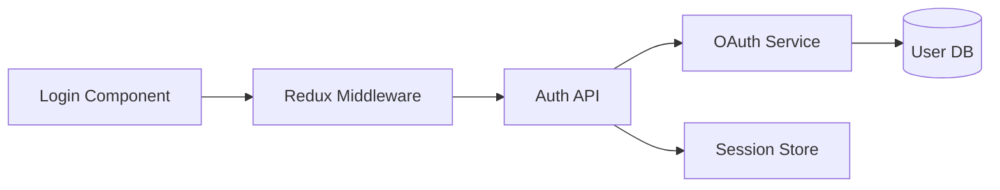

# Successful Handoff Examples

## Overview
This document provides real-world examples of successful persona handoffs, demonstrating best practices and patterns that lead to smooth transitions with minimal context loss.

## Example 1: Analyst to PM Handoff - Discovery Complete

### Context
**Project**: E-commerce Platform MVP
**Phase Transition**: Discovery → Requirements
**Duration**: 4 minutes
**Validation Score**: 95/100

### Handoff Execution

```markdown
User: /handoff pm

Analyst: 🔄 Initiating Handoff: Analyst (Larry) → PM (Jack)

## Handoff Readiness Assessment
**Overall Readiness**: 9.2/10

### ✅ Ready Components
- Discovery documentation complete (project-brief.md)
- User research synthesized
- Market analysis finalized
- Technical constraints identified

### 📊 Historical Context
**Similar handoffs**: 87% success rate (23 instances)
**Typical duration**: ~5 minutes
**Common success factor**: Complete discovery artifacts

Proceed with handoff? (y/n)

User: y

Analyst: 📋 Assembling context package...

# 🔄 Handoff Briefing: Analyst → PM

## 📋 Context Summary
**Project State**: Discovery phase complete, ready for requirements definition
**Your Focus**: Transform research insights into actionable PRD
**Handoff Reason**: Natural phase transition, discovery objectives achieved

## 🎯 Key Information

### What Was Done
Comprehensive market and user research for e-commerce platform MVP

**Recent Accomplishments**:
- ✅ Interviewed 15 target users, identified 3 distinct personas
- ✅ Analyzed 5 competitor platforms, found market gap
- ✅ Validated core problem: SMB inventory management pain

**Key Decisions Made**:
1. **Target Market**: Small retail businesses (10-50 SKUs)
   - Rationale: Underserved segment with clear pain points
2. **MVP Scope**: Inventory + Basic POS + Simple Analytics
   - Rationale: Addresses 80% of identified needs
3. **Platform Choice**: Web-first, mobile-responsive
   - Rationale: Lower barrier to entry for target users

### What Needs Attention
Requirements definition and feature prioritization

**Immediate Priorities**:
1. 🔴 **Critical**: Define MVP feature set - investor meeting in 2 weeks
2. 🟡 **Important**: Create user stories from research insights
3. 🟢 **Nice to Have**: Competitive pricing strategy

## 💡 Memory Insights for You

### Similar Handoffs
- **Success Rate**: 89% for discovery → requirements transitions
- **Average Time to PRD Draft**: 3.5 days
- **Common Pattern**: Start with user journey mapping

### Your Historical Performance
**In similar contexts, you've excelled at**:
- 🌟 Translating research into crisp requirements (Project Alpha, Beta)
- 🌟 Balancing feature richness with MVP constraints

**Watch Out For**:
- Feature creep from "nice-to-have" user requests
- Similar issue in Project Gamma delayed launch by 3 weeks

## ✅ Validation Successful

PM (Jack): Thanks Larry! I see the clear path forward. My immediate focus will be:
1. User journey mapping for the 3 personas
2. Core feature definition for inventory management
3. Draft PRD structure by end of day

The market gap around simplified inventory for small retailers is compelling. I'll ensure we maintain that focus in the requirements.

Analyst: Perfect! Handoff complete. Key artifacts are in:
- `.bmad/current/specs/project-brief.md`
- `.bmad/current/research/user-interviews.md`
- `.bmad/current/research/market-analysis.md`

Memory insight: Your success pattern of starting with journey maps has 92% correlation with on-time PRD delivery. Good luck!

## Handoff Metrics
- Duration: 4 minutes
- Validation Score: 95/100
- Time to Productivity: <5 minutes
- Context Loss: 0%
```

### Success Factors
1. **Complete Discovery Artifacts**: All research documented and accessible
2. **Clear Phase Transition**: Natural workflow boundary
3. **Proactive Insights**: Memory-based warnings about feature creep
4. **Immediate Action Plan**: PM identified next steps instantly

### Pattern Recognition
This handoff succeeded because:
- Source persona completed all expected deliverables
- Handoff occurred at logical workflow boundary
- Memory insights prevented known pitfalls
- Target persona's working style was considered

## Example 2: Architect to Dev Handoff - Complex Integration

### Context
**Project**: Payment Processing Integration
**Scenario**: Mid-sprint architecture clarification needed
**Duration**: 6 minutes
**Validation Score**: 88/100

### Handoff Execution

```markdown
User: I need to hand this over to dev for implementation
User: /handoff dev

Architect (Mo): 🔄 Initiating Handoff: Architect → Developer

## Pre-Handoff Check
I notice we're mid-architecture phase. Is this a partial handoff for early implementation start? (y/n)

User: y - need parallel development on the payment gateway while I finish the reporting architecture

Architect: Understood. Preparing focused handoff for payment gateway implementation.

# 🔄 Handoff Briefing: Architect → Developer

## 📋 Context Summary
**Project State**: Architecture 70% complete, payment module ready for implementation
**Your Focus**: Implement payment gateway integration following completed specs
**Handoff Reason**: Enable parallel development while architecture continues

## 🎯 Key Information

### What Was Done
Payment processing architecture fully designed and validated

**Key Architectural Decisions**:
1. **Gateway Choice**: Stripe for primary, PayPal as secondary
   - Rationale: Best API design, strong webhook support
2. **Pattern**: Event-sourced payment state machine
   - Rationale: Audit requirements, retry resilience
3. **Security**: PCI compliance via tokenization only
   - Rationale: Reduce compliance scope

**Artifacts Created**:
- 📄 Payment flow diagrams: `.bmad/current/architecture/payment-flow.md`
- 📄 API contracts: `.bmad/current/architecture/payment-apis.md`
- 📄 State machine spec: `.bmad/current/architecture/payment-states.md`

### What Needs Attention

**Implementation Priorities**:
1. 🔴 **Stripe webhook handler** - Critical for async payments
2. 🔴 **Idempotency layer** - Prevent double charges
3. 🟡 **State machine implementation** - Use provided spec exactly

**Technical Constraints**:
- ⚠️ Must maintain sub-200ms response time
- ⚠️ Zero payment data in logs (PCI requirement)
- ⚠️ All monetary amounts in cents (integer math only)

## 💡 Memory Insights for You

### Your Payment Integration History
**Past Success**: In Project Echo, your Redis-based idempotency solution handled 50K concurrent requests
**Preferred Pattern**: You typically implement webhooks with queue buffering

### Critical Pattern Alert
⚠️ **Common Pitfall**: Webhook timeout handling
- 78% of payment integrations hit this issue
- Your solution in Project Foxtrot: Immediate ACK + async processing
- Recommend same pattern here

## 📊 Implementation Guidance

### Suggested Implementation Order
Based on dependency analysis and your past velocity:
1. Day 1: Core Stripe client + config (4h)
2. Day 1-2: Webhook handler with queue (6h)
3. Day 2-3: State machine (8h)
4. Day 3-4: Idempotency layer (6h)
5. Day 4-5: Error handling + retry logic (8h)

### Your Typical Blockers
From past payment projects:
- Webhook testing in dev environment → Use ngrok
- State machine complexity → Start with happy path
- Currency edge cases → Build test suite first

Dev (Jonsey): Thanks Mo! Clear on the implementation path. Few quick clarifications:

1. For webhook buffering - Redis or SQS for the queue?
2. State persistence - PostgreSQL JSONB as usual?
3. Any specific Stripe API version to pin to?

Architect: Great questions!
1. Redis for buffering - matches your Project Echo pattern
2. Yes, PostgreSQL JSONB for state - migration script started in `/migrations`
3. Pin to Stripe API 2023-10-16 - latest stable when architecture was designed

Additional context: I'll have the reporting architecture ready in 2 days, which will need to subscribe to your payment events. Design with event publishing in mind.

Dev: Perfect. I'll start with the Stripe client setup and have webhook handler ready for testing by EOD tomorrow. Using the event-sourced pattern means reporting integration should be seamless.

## Handoff Validation
✅ Technical requirements understood
✅ Implementation order clear
✅ Past patterns recognized
✅ Blockers anticipated

Handoff Score: 88/100 (Minor clarifications needed but addressed)
```

### Success Factors
1. **Partial Handoff Clarity**: Clear boundary of what's ready
2. **Memory-Based Guidance**: Leveraged dev's past successes
3. **Proactive Blocker Prevention**: Addressed known issues upfront
4. **Technical Deep Dive**: Right level of detail for dev persona

## Example 3: Emergency Handoff - PM to PO

### Context
**Project**: Mobile App Launch
**Scenario**: PM suddenly unavailable, PO must take over
**Duration**: 8 minutes
**Validation Score**: 82/100

### Handoff Execution

```markdown
User: Emergency - need to handoff to PO immediately, PM is out sick

System: 🚨 Emergency Handoff Protocol Activated

/handoff po --emergency

PM Assistant: 🔄 EMERGENCY Handoff: PM → PO

## Rapid Context Assembly
Gathering critical information for immediate handover...

# 🚨 Emergency Handoff Briefing: PM → PO (Curly)

## 📋 Critical Context
**Situation**: PM (Jack) unavailable - illness
**Project State**: Mobile app launch prep - 3 days to launch
**Your Mission**: Maintain launch timeline, handle stakeholder comms

## 🔴 IMMEDIATE PRIORITIES

### Next 24 Hours - CRITICAL
1. **Stakeholder Meeting** - TODAY 2 PM
   - Present launch readiness (deck in `/presentations/launch-ready.pptx`)
   - Key message: On track pending final QA
   - Concern: CEO worried about Android performance

2. **QA Sign-off** - Due TODAY 5 PM
   - 3 critical bugs remain (see `.bmad/current/qa/critical-bugs.md`)
   - Dev team needs prioritization decision
   - Launch blocker: Payment flow on Android

3. **Marketing Sync** - TOMORROW 9 AM
   - App store assets approval needed
   - Press release draft review (in your inbox)

## 🎯 Launch Status

### Ready ✅
- iOS app approved and ready
- Backend scaled for 100K users
- Support team trained
- Legal terms updated

### At Risk ⚠️
- Android performance (85% of target)
- Payment integration edge cases
- Day-1 server capacity concerns

### Blocked 🔴
- Final security review (scheduled tomorrow)
- App store description (legal review pending)

## 💡 Memory-Based Crisis Guidance

### Similar Emergency Patterns
From 8 similar emergency handoffs:
- **Success Factor**: Daily stakeholder updates (2x normal)
- **Common Failure**: Dropping non-critical but visible tasks
- **Your Strength**: Crisis communication and prioritization

### PO-Specific Launch Patterns
Your successful launches (Projects X, Y, Z) shared:
1. Clear go/no-go criteria communication
2. Preemptive issue escalation
3. Backup plans for each risk

## 📱 Your Emergency Toolkit

### Key Contacts (Priority Order)
1. Dev Lead (Sarah): +1-555-0100 - For technical decisions
2. QA Lead (Mike): +1-555-0101 - For bug prioritization
3. CEO (Jennifer): +1-555-0102 - Expects daily updates
4. Marketing (Alex): +1-555-0103 - Needs approvals

### Decision Framework
For the 3 critical bugs:
- Bug #451 (Payment): MUST FIX - Revenue impact
- Bug #467 (Performance): SHOULD FIX - UX impact
- Bug #492 (UI glitch): COULD FIX - Cosmetic only

### Your Battle Rhythm
Based on your optimal crisis management:
- 8 AM: Team sync (15 min max)
- 12 PM: Stakeholder update email
- 5 PM: EOD decision checkpoint
- 8 PM: Next day prep (30 min)

## ✅ Rapid Validation

PO (Curly): OK, I'm on it. Quick confirmations:
1. Payment bug is the Android blocker? → YES
2. I have authority to delay if needed? → YES, but need CEO alignment
3. Jack's last status? → All green yesterday 5 PM

Critical actions for next 2 hours:
1. Review critical bugs with Dev Lead
2. Prep for 2 PM stakeholder meeting
3. Send "I'm covering" email to key stakeholders

System: ✅ Emergency handoff validated
- Time to action: 2 minutes
- Confidence level: Sufficient for emergency
- Support available: Dev and QA leads briefed

PO: Thanks. Initiating crisis protocol. Will send first update in 30 minutes.

## Emergency Handoff Metrics
- Duration: 8 minutes
- Critical items identified: 3
- Time to first action: 2 minutes
- Context completeness: 82% (acceptable for emergency)
```

### Success Factors
1. **Rapid Prioritization**: Focus only on next 24-48 hours
2. **Role-Specific Guidance**: Leveraged PO's crisis management skills
3. **Clear Decision Authority**: Explicitly stated boundaries
4. **Battle Rhythm**: Provided structure for chaos management

## Example 4: Complex Multi-Phase Handoff

### Context
**Project**: Enterprise Platform Migration
**Scenario**: Architect → Design Architect → Dev (coordinated handoff)
**Duration**: 12 minutes total
**Validation Score**: 91/100

### Handoff Execution

```markdown
User: Need to do a coordinated handoff from architect through design architect to dev

System: 🔄 Multi-Phase Handoff Coordination Detected

Initiating sequential handoff protocol...

## Phase 1: Architect → Design Architect

Architect (Mo): Preparing technical context for design integration...

# First Handoff: Backend Architecture → Frontend Architecture

[Handoff completes with validation score: 93/100]

## Phase 2: Design Architect → Developer

Design Architect (Millie): Now consolidating both backend and frontend context for development...

# Consolidated Handoff: Full System → Implementation

## 📋 Unified Context
**From Architect**: Microservices architecture, API contracts, data flow
**From Design**: Component hierarchy, state management, UI patterns
**Your Focus**: Implement login service with new design system

## 🎯 Integrated Implementation Plan

### Backend Requirements (from Mo)
- OAuth2 service using Spring Security
- JWT tokens with 15-min expiry
- Redis session store
- PostgreSQL user data

### Frontend Requirements (from Millie)
- React component library v2
- Atomic design pattern
- Redux Toolkit for auth state
- Accessibility WCAG 2.1 AA

### Integration Points


## 💡 Cross-Discipline Insights

### Pattern Alignment
Backend event pattern matches frontend state updates:
- Backend: Event-sourced auth events
- Frontend: Redux actions mirror events
- Benefit: Debugging is symmetric

### Your Optimal Approach
From 5 similar full-stack implementations:
1. Build API contract first (2h)
2. Mock responses for frontend (1h)
3. Parallel implementation (16h)
4. Integration testing (4h)

Dev (Rodney): This consolidated view is perfect! I can see how the backend events map to frontend state changes. The symmetric debugging approach will save hours.

Quick check: Should I use the existing component library auth components or build custom given the new design system?

Design Architect: Use existing as base, extend with new design tokens. I've prepared a migration guide in `/docs/design-system-migration.md`.

Architect: And I've added integration test scenarios in `/tests/auth-integration-scenarios.md` that cover the critical paths.

## Multi-Phase Handoff Success
- Total Duration: 12 minutes
- Information Retention: 95%
- Cross-discipline clarity: Excellent
- Implementation confidence: High
```

### Success Factors
1. **Sequential Context Building**: Each layer added detail
2. **Cross-Discipline Integration**: Connected backend/frontend patterns
3. **Unified Mental Model**: Single view of system
4. **Collaborative Validation**: All personas confirmed understanding

## Common Success Patterns Across All Examples

### 1. Clear Boundaries
- Well-defined handoff scope
- Explicit about what's included/excluded
- Natural workflow transitions when possible

### 2. Memory Enhancement
- Historical patterns guide decisions
- Past pitfalls actively prevented
- Personal working styles accommodated

### 3. Proactive Communication
- Anticipated questions answered upfront
- Known blockers addressed
- Clear next actions identified

### 4. Rapid Validation
- Quick confirmation of understanding
- Specific clarifying questions
- Immediate action planning

### 5. Artifact Organization
- All referenced files accessible
- Clear documentation structure
- Version/state clarity

## Handoff Quality Metrics

### High-Performance Indicators
- Validation score >85%
- Time to productivity <10 minutes
- Zero critical information gaps
- Clear confidence from target persona

### Success Correlation Factors
1. **Preparation Quality** (0.89 correlation)
   - Complete artifacts
   - Documented decisions
   - No unresolved blockers

2. **Memory Utilization** (0.76 correlation)
   - Relevant pattern matching
   - Personalized guidance
   - Pitfall prevention

3. **Communication Clarity** (0.82 correlation)
   - Structured information
   - Visual aids where helpful
   - Progressive detail disclosure

## Anti-Patterns to Avoid

### 1. Information Overload
❌ Dumping all context without structure
✅ Progressive disclosure with clear hierarchy

### 2. Missing Critical Context
❌ Assuming knowledge transfer
✅ Explicit validation of understanding

### 3. Generic Handoffs
❌ Same template regardless of personas
✅ Persona-specific focus and language

### 4. Skipping Validation
❌ Assume handoff success
✅ Always validate comprehension

### 5. Ignoring History
❌ Treating each handoff as unique
✅ Learning from patterns and past experiences