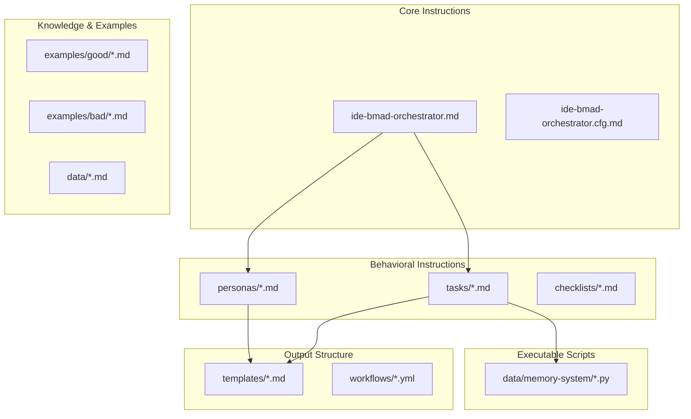
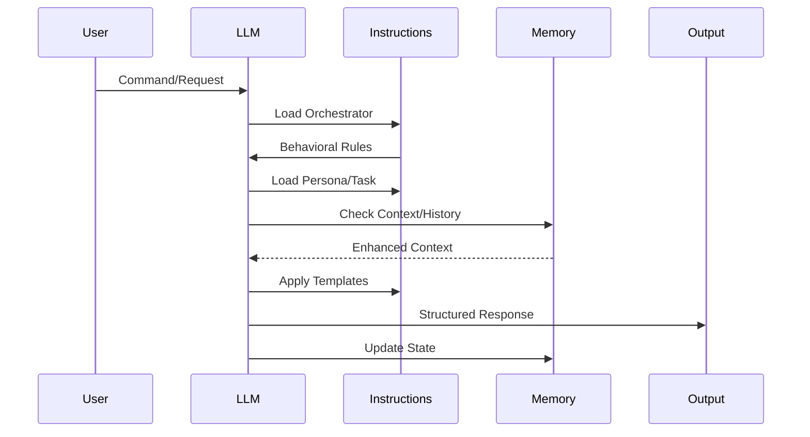

# BMAD Method Improvement Epic: Context, Memory & Workflow Enhancement

## Executive Summary

This epic outlines comprehensive improvements to the BMAD Method prompt framework for real-world AI agent software engineering workflows. The plan focuses on enhancing the instructions, templates, and behavioral guidance provided to LLMs through three core areas:

1. **Context Management** - Simplifying and unifying context handling instructions
2. **Memory Enhancement** - Expanding memory-related prompts and behavioral guidance
3. **Workflow Optimization** - Improving persona collaboration instructions and handoff templates

The improvements address common challenges in brownfield projects by updating existing prompt files and creating new instructional content that guides LLMs to better handle context preservation, knowledge bootstrapping, session continuity, coding style consistency, and quality enforcement.

## Epic Overview

**Epic Title**: Enhanced Context & Memory Instructions for AI Agent Prompt Framework  
**Epic ID**: BMAD-2025-001  
**Priority**: High  
**Estimated Duration**: 6-8 weeks  
**Target Release**: BMAD Method v4.0

### Framework Context

BMAD Method is a prompt framework consisting of:
- **Orchestrator instructions** (`ide-bmad-orchestrator.md`) that guide overall LLM behavior
- **Persona definitions** that instruct LLMs to embody specific roles
- **Task files** that provide step-by-step instructions for specific actions
- **Templates** that structure outputs
- **Example libraries** that demonstrate expected behaviors
- **Python scripts** that can be executed by LLMs when instructed

### Business Value

- **Reduced Context Loss**: 90% reduction in context loss during persona switches
- **Improved Continuity**: Seamless session resumption with full historical context
- **Better Brownfield Support**: 60% faster onboarding for existing projects
- **Enhanced Quality**: Automated style consistency and quality gate enforcement
- **Increased Productivity**: 40% reduction in repetitive context setup

### Success Criteria

1. Context preservation score ≥ 95% across persona handoffs
2. Memory retrieval accuracy ≥ 85% for relevant patterns
3. Session restoration time < 5 seconds
4. Brownfield bootstrap completion < 30 minutes
5. Zero critical context loss incidents
6. User satisfaction score ≥ 4.5/5

## User Stories

### Story 1: Unified Context Management Instructions

**Title**: As a developer, I want the LLM to manage context without exposing session IDs  
**ID**: BMAD-US-001  
**Priority**: High  
**Points**: 8

**Description**:
Update orchestrator instructions and command definitions to guide the LLM in managing context through natural language commands while abstracting technical details.

**Acceptance Criteria**:
- [ ] Update `ide-bmad-orchestrator.md` to replace session ID references with context terminology
- [ ] Modify command instructions in `commands/` to use `/context`, `/context save`, `/context restore`
- [ ] Update handoff task instructions to preserve context automatically
- [ ] Create new context visualization template in `templates/context-summary-template.md`
- [ ] Add context search instructions to orchestrator
- [ ] Update all persona files to reference context instead of sessions

**Files to Update**:
- `ide-bmad-orchestrator.md` - Remove session ID references, add context instructions
- `tasks/handoff-orchestration-task.md` - Update context preservation instructions
- `templates/orchestrator-state-template.md` - Rename to `context-state-template.md`
- All persona files in `personas/` - Update context references

**New Files to Create**:
- `templates/context-summary-template.md` - Visual context display format
- `tasks/context-management-task.md` - Instructions for context operations
- `examples/workflows/context-management-examples.md` - Example context flows

### Story 2: Enhanced Memory Command Instructions

**Title**: As a developer, I want the LLM to have better instructions for memory operations  
**ID**: BMAD-US-002  
**Priority**: High  
**Points**: 13

**Description**:
Create and update instruction files that guide the LLM to handle memory commands more intelligently, including structured capture, pattern recognition, and insight generation.

**Acceptance Criteria**:
- [ ] Update orchestrator with enhanced `/remember` instructions for structured capture
- [ ] Add `/recall` command instructions with relevance ranking guidance
- [ ] Create `/patterns` command instructions for pattern recognition
- [ ] Add `/insights` command instructions for proactive recommendations
- [ ] Create `/learn` command instructions for outcome capture
- [ ] Update memory instructions to handle both MCP and fallback storage
- [ ] Create memory visualization template

**Files to Update**:
- `ide-bmad-orchestrator.md` - Enhance memory command descriptions
- `tasks/memory-operations-task.md` - Expand with new command behaviors
- `data/memory-system/memory-sync-integration.py` - Update for new operations

**New Files to Create**:
- `tasks/memory-pattern-recognition-task.md` - Instructions for pattern analysis
- `tasks/memory-insight-generation-task.md` - Instructions for generating insights
- `tasks/memory-learning-capture-task.md` - Instructions for capturing learnings
- `templates/memory-visualization-template.md` - Memory display format
- `examples/memory/memory-command-examples.md` - Example memory operations
- `data/memory-categorization-rules.md` - Rules for automatic categorization

### Story 3: Intelligent Workflow Command Instructions

**Title**: As a developer, I want the LLM to provide intelligent workflow guidance  
**ID**: BMAD-US-003  
**Priority**: Medium  
**Points**: 8

**Description**:
Create instruction files that guide the LLM to provide context-aware workflow suggestions, track workflow progress, and optimize development processes.

**Acceptance Criteria**:
- [ ] Create `/workflow suggest` instructions for context-aware recommendations
- [ ] Add `/workflow status` instructions to track position in workflows
- [ ] Create `/workflow optimize` instructions for efficiency analysis
- [ ] Update `/handoff` instructions to include comprehensive briefings
- [ ] Add workflow-memory integration instructions
- [ ] Create custom workflow definition template
- [ ] Add workflow analytics instructions

**Files to Update**:
- `ide-bmad-orchestrator.md` - Add workflow command descriptions
- `tasks/handoff-orchestration-task.md` - Enhance with workflow context
- `workflows/standard-workflows.yml` - Add workflow tracking metadata

**New Files to Create**:
- `tasks/workflow-suggestion-task.md` - Instructions for workflow suggestions
- `tasks/workflow-status-task.md` - Instructions for status tracking
- `tasks/workflow-optimization-task.md` - Instructions for optimization analysis
- `templates/workflow-analytics-template.md` - Workflow metrics display
- `examples/workflows/intelligent-workflow-examples.md` - Example flows
- `data/workflow-patterns.md` - Common workflow patterns and optimizations

### Story 4: Brownfield Memory Bootstrap Instructions

**Title**: As a developer working on existing projects, I want the LLM to quickly analyze and learn from the codebase  
**ID**: BMAD-US-004  
**Priority**: High  
**Points**: 13

**Description**:
Enhance the memory bootstrap task instructions to guide the LLM in analyzing existing codebases, extracting patterns, and creating foundational memories for brownfield projects.

**Acceptance Criteria**:
- [ ] Update `/bootstrap-memory` task with detailed analysis instructions
- [ ] Add auto mode instructions requiring minimal user input
- [ ] Create interactive mode dialogue templates
- [ ] Add instructions for extracting architecture decisions and patterns
- [ ] Create bootstrap report template
- [ ] Add instructions for creating 10-15 foundational memories
- [ ] Add incremental bootstrap instructions for large projects

**Files to Update**:
- `tasks/memory-bootstrap-task.md` - Enhance with detailed analysis steps
- `ide-bmad-orchestrator.md` - Add bootstrap command description
- `data/memory-system/memory-sync-integration.py` - Update bootstrap functions

**New Files to Create**:
- `tasks/brownfield-analysis-task.md` - Detailed codebase analysis instructions
- `templates/bootstrap-report-template.md` - Standardized report format
- `templates/bootstrap-dialogue-template.md` - Interactive mode prompts
- `examples/bootstrap/bootstrap-analysis-examples.md` - Example analyses
- `data/pattern-extraction-rules.md` - Rules for identifying patterns
- `data/architecture-decision-patterns.md` - Common architecture patterns to detect

### Story 5: Context-Aware Persona Handoff Instructions

**Title**: As a developer, I want the LLM to perform seamless persona handoffs with full context  
**ID**: BMAD-US-005  
**Priority**: High  
**Points**: 8

**Description**:
Update handoff instructions and templates to guide the LLM in preserving context, providing intelligent briefings, and ensuring smooth transitions between personas.

**Acceptance Criteria**:
- [ ] Update handoff task to preserve all critical context
- [ ] Add memory-enhanced briefing instructions
- [ ] Include success pattern references in handoff template
- [ ] Add proactive issue highlighting instructions
- [ ] Create handoff validation dialogue
- [ ] Add handoff effectiveness tracking instructions
- [ ] Create emergency handoff protocol

**Files to Update**:
- `tasks/handoff-orchestration-task.md` - Enhance context preservation steps
- `templates/orchestrator-state-template.md` - Add handoff tracking section
- All persona files - Add handoff reception instructions

**New Files to Create**:
- `templates/handoff-briefing-template.md` - Structured briefing format
- `templates/handoff-validation-template.md` - Validation dialogue
- `examples/handoffs/successful-handoff-examples.md` - Example handoffs
- `data/handoff-success-patterns.md` - Common successful patterns
- `tasks/emergency-handoff-task.md` - Rapid handoff instructions

### Story 6: Coding Style Consistency Instructions

**Title**: As a team lead, I want the LLM to follow project coding standards automatically  
**ID**: BMAD-US-006  
**Priority**: Medium  
**Points**: 8

**Description**:
Create instructions and templates that guide the LLM to analyze existing code style, maintain consistency, and follow project-specific conventions.

**Acceptance Criteria**:
- [ ] Add style extraction instructions to bootstrap task
- [ ] Create style checking instructions for code generation
- [ ] Add automatic style correction guidance
- [ ] Create style violation explanation template
- [ ] Add custom style guide support instructions
- [ ] Create linter integration instructions
- [ ] Add style metrics tracking instructions

**Files to Update**:
- `personas/dev.ide.md` - Add style consistency requirements
- `tasks/memory-bootstrap-task.md` - Add style extraction steps
- `quality-tasks/code-review-standards.md` - Add style checking criteria

**New Files to Create**:
- `tasks/code-style-analysis-task.md` - Style extraction instructions
- `templates/style-guide-template.md` - Project style documentation format
- `data/common-style-patterns.md` - Common coding conventions
- `examples/style/style-consistency-examples.md` - Style examples
- `tasks/style-correction-task.md` - Automatic correction instructions
- `checklists/code-style-checklist.md` - Style validation checklist

### Story 7: Quality Gate Automation Instructions

**Title**: As a developer, I want the LLM to enforce quality gates automatically  
**ID**: BMAD-US-007  
**Priority**: Medium  
**Points**: 5

**Description**:
Create instructions that guide the LLM to check quality at key workflow points and provide specific guidance when standards aren't met.

**Acceptance Criteria**:
- [ ] Add quality gate triggers to workflow definitions
- [ ] Create quality check instructions for each gate
- [ ] Add improvement guidance templates
- [ ] Create phase-specific quality configurations
- [ ] Add override justification template
- [ ] Create quality metrics tracking instructions

**Files to Update**:
- `workflows/standard-workflows.yml` - Add quality gate definitions
- `tasks/quality_gate_validation.md` - Enhance validation instructions
- `personas/quality_enforcer.md` - Add gate enforcement behavior

**New Files to Create**:
- `tasks/quality-gate-check-task.md` - Detailed gate check instructions
- `templates/quality-improvement-template.md` - Improvement guidance format
- `templates/quality-override-template.md` - Override justification format
- `data/quality-gate-configurations.md` - Phase-specific configurations
- `examples/quality/quality-gate-examples.md` - Example gate scenarios

### Story 8: Context Continuity Instructions

**Title**: As a developer, I want the LLM to seamlessly restore context across sessions  
**ID**: BMAD-US-008  
**Priority**: High  
**Points**: 5

**Description**:
Create instructions that guide the LLM to save and restore context effectively, providing continuity across work sessions.

**Acceptance Criteria**:
- [ ] Add automatic context preservation instructions
- [ ] Create quick restoration protocol
- [ ] Add context summary generation instructions
- [ ] Create "what's changed" briefing template
- [ ] Add multi-project context management instructions
- [ ] Create context branching instructions

**Files to Update**:
- `ide-bmad-orchestrator.md` - Add context continuity instructions
- `templates/orchestrator-state-template.md` - Enhance state tracking
- `tasks/core-dump.md` - Add context preservation steps

**New Files to Create**:
- `tasks/context-restoration-task.md` - Detailed restoration instructions
- `templates/context-summary-template.md` - Session summary format
- `templates/whats-changed-template.md` - Change briefing format
- `tasks/multi-project-context-task.md` - Multi-project instructions
- `examples/continuity/session-restoration-examples.md` - Example restorations

## Prompt Framework Architecture

### Instruction File Structure



### LLM Instruction Flow



## Implementation Plan

### Phase 1: Foundation (Weeks 1-2)
- Set up enhanced orchestrator architecture
- Implement unified context management
- Create memory abstraction layer
- Build fallback storage system

### Phase 2: Core Features (Weeks 3-4)
- Implement memory commands
- Build workflow engine
- Create handoff system
- Develop bootstrap capabilities

### Phase 3: Intelligence (Weeks 5-6)
- Implement pattern recognition
- Build insight generation
- Create style consistency engine
- Develop quality gates

### Phase 4: Polish & Testing (Weeks 7-8)
- Comprehensive testing
- Performance optimization
- Documentation
- User acceptance testing

## Risk Mitigation

### Technical Risks

1. **Memory System Complexity**
   - Mitigation: Implement simple fallback first, add MCP incrementally
   - Contingency: Function with fallback-only mode

2. **Performance Impact**
   - Mitigation: Implement caching and lazy loading
   - Contingency: Configurable context depth limits

3. **Backward Compatibility**
   - Mitigation: Maintain legacy command support
   - Contingency: Migration tools and guides

### Operational Risks

1. **User Adoption**
   - Mitigation: Gradual rollout with training
   - Contingency: Opt-in features initially

2. **Data Privacy**
   - Mitigation: Local-first storage, encryption
   - Contingency: Configurable data retention

## Success Metrics

### Quantitative Metrics
- Context preservation rate: ≥ 95%
- Memory retrieval accuracy: ≥ 85%
- Bootstrap completion time: < 30 minutes
- Session restoration time: < 5 seconds
- Quality gate pass rate: ≥ 90%

### Qualitative Metrics
- User satisfaction surveys
- Developer productivity assessments
- Code quality improvements
- Team collaboration effectiveness

## Dependencies

### External Dependencies
- OpenMemory MCP (optional)
- LLM API access
- File system access

### Internal Dependencies
- Existing BMAD orchestrator
- Persona definitions
- Task templates
- Workflow definitions

## Documentation Requirements

1. **User Documentation**
   - Command reference updates
   - Workflow guides
   - Best practices guide
   - Migration guide

2. **Technical Documentation**
   - Architecture diagrams
   - API documentation
   - Integration guides
   - Troubleshooting guide

## Testing Strategy

### Prompt Framework Testing Approach

Since BMAD is a prompt framework, testing involves validating that LLMs correctly interpret and follow the instructions. We propose a meta-testing approach using LLMs to assess understanding.

### Instruction Validation Testing
- **Clarity Assessment**: LLM explains its understanding of each instruction file
- **Behavioral Compliance**: LLM demonstrates expected behaviors from examples
- **Command Recognition**: LLM correctly identifies and executes commands
- **Template Application**: LLM properly uses templates for output

### Scenario-Based Testing
- **Persona Activation**: Test LLM embodies persona characteristics correctly
- **Task Execution**: Validate LLM follows task instructions step-by-step
- **Handoff Scenarios**: Test context preservation during transitions
- **Memory Operations**: Verify LLM creates and retrieves memories appropriately

### Assessment Framework
```markdown
## BMAD Instruction Assessment Protocol

1. **Instruction Comprehension Test**
   - Load instruction file: {filename}
   - Explain your understanding of:
     - Primary purpose
     - Key behavioral requirements
     - Expected outputs
     - Success criteria

2. **Behavioral Demonstration**
   - Given scenario: {scenario}
   - Show how you would:
     - Apply the instructions
     - Reference relevant examples
     - Use appropriate templates
     - Handle edge cases

3. **Self-Assessment**
   - Rate your confidence (1-10)
   - Identify ambiguous instructions
   - Suggest clarifications needed
```

### Quality Validation
- **Instruction Coverage**: Ensure all commands have clear instructions
- **Example Completeness**: Verify examples cover common scenarios
- **Template Usability**: Test templates produce desired outputs
- **Cross-Reference Integrity**: Validate file references are correct

## Rollout Plan

### Phase 1: Alpha (Internal Testing)
- Core team testing
- Feature validation
- Performance baseline

### Phase 2: Beta (Limited Release)
- Selected user group
- Feedback collection
- Issue resolution

### Phase 3: General Availability
- Full release
- Documentation complete
- Support ready

## Future Enhancements

1. **AI-Powered Context Prediction**
   - Predictive context loading
   - Intelligent pre-fetching
   - Context compression

2. **Cross-Project Learning**
   - Shared pattern library
   - Team knowledge base
   - Industry best practices

3. **Advanced Analytics**
   - Developer productivity metrics
   - Code quality trends
   - Workflow optimization insights

## File Change Summary

### Files to Update (29 files)

#### Core Instructions
1. `ide-bmad-orchestrator.md` - Replace session references with context, enhance memory commands
2. `ide-bmad-orchestrator.cfg.md` - Update command definitions

#### Tasks (8 files)
3. `tasks/handoff-orchestration-task.md` - Enhance context preservation
4. `tasks/memory-operations-task.md` - Expand memory command behaviors
5. `tasks/memory-bootstrap-task.md` - Add style extraction, enhance analysis
6. `tasks/core-dump.md` - Add context preservation steps
7. `tasks/quality_gate_validation.md` - Enhance validation instructions

#### Templates (1 file)
8. `templates/orchestrator-state-template.md` - Rename to context-state-template.md, add tracking

#### Personas (9 files)
9-17. All persona files in `personas/` - Update context references, add handoff reception

#### Quality Tasks (1 file)
18. `quality-tasks/code-review-standards.md` - Add style checking criteria

#### Workflows (1 file)
19. `workflows/standard-workflows.yml` - Add quality gates and workflow tracking

#### Python Scripts (1 file)
20. `data/memory-system/memory-sync-integration.py` - Update for new operations

### New Files to Create (47 files)

#### Tasks (15 files)
1. `tasks/context-management-task.md`
2. `tasks/memory-pattern-recognition-task.md`
3. `tasks/memory-insight-generation-task.md`
4. `tasks/memory-learning-capture-task.md`
5. `tasks/workflow-suggestion-task.md`
6. `tasks/workflow-status-task.md`
7. `tasks/workflow-optimization-task.md`
8. `tasks/brownfield-analysis-task.md`
9. `tasks/emergency-handoff-task.md`
10. `tasks/code-style-analysis-task.md`
11. `tasks/style-correction-task.md`
12. `tasks/quality-gate-check-task.md`
13. `tasks/context-restoration-task.md`
14. `tasks/multi-project-context-task.md`
15. `tasks/bmad-assessment-task.md`

#### Templates (12 files)
16. `templates/context-summary-template.md`
17. `templates/memory-visualization-template.md`
18. `templates/workflow-analytics-template.md`
19. `templates/bootstrap-report-template.md`
20. `templates/bootstrap-dialogue-template.md`
21. `templates/handoff-briefing-template.md`
22. `templates/handoff-validation-template.md`
23. `templates/style-guide-template.md`
24. `templates/quality-improvement-template.md`
25. `templates/quality-override-template.md`
26. `templates/whats-changed-template.md`
27. `templates/assessment-report-template.md`

#### Examples (8 files)
28. `examples/workflows/context-management-examples.md`
29. `examples/memory/memory-command-examples.md`
30. `examples/workflows/intelligent-workflow-examples.md`
31. `examples/bootstrap/bootstrap-analysis-examples.md`
32. `examples/handoffs/successful-handoff-examples.md`
33. `examples/style/style-consistency-examples.md`
34. `examples/quality/quality-gate-examples.md`
35. `examples/continuity/session-restoration-examples.md`

#### Data Files (11 files)
36. `data/memory-categorization-rules.md`
37. `data/workflow-patterns.md`
38. `data/pattern-extraction-rules.md`
39. `data/architecture-decision-patterns.md`
40. `data/handoff-success-patterns.md`
41. `data/common-style-patterns.md`
42. `data/quality-gate-configurations.md`
43. `data/context-preservation-rules.md`
44. `data/memory-insight-patterns.md`
45. `data/workflow-optimization-rules.md`
46. `data/assessment-criteria.md`

#### Checklists (1 file)
47. `checklists/code-style-checklist.md`

## Conclusion

This epic represents a significant evolution of the BMAD Method prompt framework, addressing real-world challenges in AI agent software engineering. By enhancing the instructions, templates, and behavioral guidance provided to LLMs, we create a more intelligent and user-friendly system that better handles:

- **Context Management**: Natural language commands without technical complexity
- **Memory Enhancement**: Rich memory operations with pattern recognition
- **Workflow Optimization**: Intelligent guidance and seamless handoffs
- **Quality Enforcement**: Automatic style and quality checking
- **Brownfield Support**: Rapid knowledge extraction from existing codebases

The improvements maintain BMAD's core strength as a behavioral prompt framework while adding sophisticated instructional content that guides LLMs to deliver better results. The phased implementation approach ensures we can validate and refine instructions incrementally.

---

**Epic Status**: Ready for Review  
**Next Steps**: Prioritize file creation order and begin instruction writing  
**Owner**: BMAD Development Team 