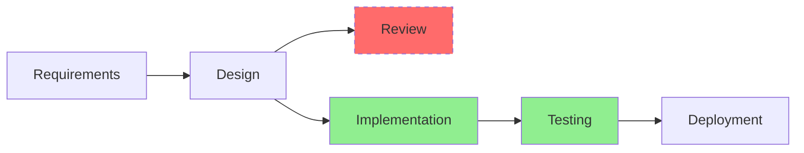

# Workflow Optimization Task

## Purpose
Analyze workflow efficiency, identify bottlenecks and improvement opportunities, and provide actionable optimization recommendations based on memory patterns and successful practices.

## Behavioral Instructions

When user invokes `/workflow optimize`:

### 1. Workflow Analysis
- **Current Workflow Assessment**:
  - Map complete workflow from start to current position
  - Identify all phases, tasks, and dependencies
  - Calculate time spent in each phase
  - Measure velocity trends across phases
  
- **Bottleneck Detection**:
  - Find phases taking longer than typical
  - Identify recurring blockers
  - Detect resource constraints
  - Analyze dependency chains

### 2. Memory-Based Pattern Analysis
Execute comprehensive memory searches:
- Query: "workflow optimization {workflow_type}"
- Query: "bottleneck resolution {phase_name}"
- Query: "successful workflow patterns {project_type}"
- Query: "efficiency improvements {team_size}"
- Query: "process optimization outcomes"

### 3. Optimization Opportunity Identification
- **Time Savings**:
  - Parallel execution opportunities
  - Task automation candidates
  - Unnecessary wait times
  - Process simplification options
  
- **Quality Improvements**:
  - Early quality gates
  - Review process optimization
  - Testing integration points
  - Documentation efficiency

- **Resource Optimization**:
  - Skill utilization analysis
  - Workload distribution
  - Collaboration patterns
  - Tool effectiveness

### 4. Impact Simulation
When `--simulate` flag is used:
- Model proposed changes
- Calculate potential time savings
- Estimate quality impact
- Predict resource requirements
- Show risk assessment

### 5. Output Format

#### Default Analysis
```
🔧 Workflow Optimization Analysis

📊 Current Workflow Performance
├─ Total Duration: {elapsed_time} (typical: {typical_time})
├─ Efficiency Score: {score}/100
├─ Bottleneck Count: {count}
└─ Optimization Potential: {potential}% improvement possible

🎯 Top 3 Optimization Opportunities

1. {optimization_1} 
   ├─ Type: {bottleneck|process|resource}
   ├─ Impact: {time_saved} reduction
   ├─ Effort: {low|medium|high}
   └─ Confidence: {confidence}%

2. {optimization_2}
   ├─ Type: {type}
   ├─ Impact: {impact}
   ├─ Effort: {effort}
   └─ Confidence: {confidence}%

3. {optimization_3}
   ├─ Type: {type}
   ├─ Impact: {impact}
   ├─ Effort: {effort}
   └─ Confidence: {confidence}%

💡 Quick Wins
├─ {quick_win_1}: {time_saved}
├─ {quick_win_2}: {time_saved}
└─ {quick_win_3}: {time_saved}

📈 Based on {count} similar workflow optimizations
```

#### Detailed Analysis with Focus Area
```
# Workflow Optimization Report: {focus_area}

## Executive Summary
Current workflow efficiency: {efficiency}%
Optimization potential: {potential}% improvement
Estimated time savings: {total_time_saved}
Implementation effort: {total_effort}

## Bottleneck Analysis

### Critical Bottlenecks 🔴
1. **{bottleneck_1}**
   - Location: {phase} → {task}
   - Current Impact: {time_impact}
   - Root Cause: {cause_analysis}
   - Frequency: Occurs in {frequency}% of workflows
   - Resolution Strategy: {strategy}
   - Similar Cases: {memory_reference}

### Moderate Bottlenecks 🟡
{bottleneck_list_with_analysis}

### Minor Inefficiencies 🟢
{inefficiency_list}

## Optimization Recommendations

### Immediate Actions (This Week)
1. **{action_1}**
   - What: {specific_action}
   - Why: {rationale}
   - How: {implementation_steps}
   - Expected Result: {outcome}
   - Success Metrics: {metrics}

### Short-term Improvements (This Month)
{short_term_recommendations}

### Strategic Changes (This Quarter)
{strategic_recommendations}

## Pattern Analysis

### Success Patterns from Memory
Based on {count} analyzed workflows:

**Pattern A: {pattern_name}**
- Used by: {teams/projects}
- Success Rate: {rate}%
- Key Factor: {factor}
- Application: {how_to_apply}

**Pattern B: {pattern_name}**
{pattern_details}

### Anti-Patterns to Avoid
⚠️ **{anti_pattern_1}**: {why_it_fails}
⚠️ **{anti_pattern_2}**: {why_it_fails}

## Simulation Results
{if --simulate flag used}

### Proposed Optimization Model


### Impact Projections
| Metric | Current | Optimized | Improvement |
|--------|---------|-----------|-------------|
| Total Duration | {current} | {optimized} | -{improvement}% |
| Bottlenecks | {current} | {optimized} | -{count} |
| Resource Util | {current}% | {optimized}% | +{improvement}% |
| Quality Score | {current} | {optimized} | +{improvement} |

### Risk Assessment
- 🟢 Low Risk: {low_risk_items}
- 🟡 Medium Risk: {medium_risk_items}
- 🔴 High Risk: {high_risk_items}

## Implementation Roadmap

### Phase 1: Quick Wins (Week 1)
- [ ] {task_1}: {owner} - {duration}
- [ ] {task_2}: {owner} - {duration}
- [ ] {task_3}: {owner} - {duration}

### Phase 2: Process Changes (Weeks 2-4)
{process_change_tasks}

### Phase 3: Measure & Adjust (Week 5+)
{measurement_plan}

## Success Metrics
Track these KPIs to measure optimization success:
1. Phase completion time reduction
2. Blocker frequency decrease
3. Team velocity improvement
4. Quality metric maintenance
5. Team satisfaction scores
```

## Behavioral Requirements

### Analytical Rigor
- Base all recommendations on data
- Quantify impacts wherever possible
- Consider both time and quality impacts
- Account for implementation effort

### Memory Integration
- Search for proven optimization patterns
- Learn from failed optimization attempts
- Consider team-specific success factors
- Reference historical improvements

### Practicality Focus
- Prioritize actionable recommendations
- Consider resource constraints
- Balance effort vs. impact
- Provide clear implementation steps

### Risk Awareness
- Identify potential negative impacts
- Consider change management needs
- Highlight critical dependencies
- Suggest mitigation strategies

## Focus Area Analysis

### Focus: Bottlenecks
When `--focus=bottlenecks`:
- Deep dive into each bottleneck
- Root cause analysis
- Dependency impact mapping
- Resolution prioritization

### Focus: Handoffs
When `--focus=handoffs`:
- Analyze handoff frequency and duration
- Identify information loss points
- Optimize transition processes
- Suggest consolidation opportunities

### Focus: Quality
When `--focus=quality`:
- Map quality check points
- Identify redundant reviews
- Optimize test coverage
- Balance speed vs. quality

### Focus: Speed
When `--focus=speed`:
- Find parallelization opportunities
- Identify unnecessary wait times
- Optimize critical path
- Automate repetitive tasks

## Comparison Baselines

### Compare to Team
When `--compare-to=team`:
```
## Team Comparison Analysis

Your Workflow vs. Team Average:
- Duration: {your_time} vs {team_avg} ({difference}%)
- Efficiency: {your_score} vs {team_avg} ({difference} points)
- Bottlenecks: {your_count} vs {team_avg} ({difference})

Top Team Practices You're Missing:
1. {practice_1}: Used by {count} high-performers
2. {practice_2}: {improvement}% average improvement
3. {practice_3}: {adoption_rate}% team adoption

Recommendation: Adopt {practice_name} for {expected_improvement}% gain
```

### Compare to Best Practices
When `--compare-to=best-practices`:
```
## Industry Best Practices Gap Analysis

Comparing to industry standards for {workflow_type}:

✅ You're Following:
- {best_practice_1}
- {best_practice_2}

❌ Missing Practices:
- {missing_1}: Industry adoption {rate}%
- {missing_2}: Typical improvement {improvement}%

🎯 Priority Adoptions:
1. {priority_1}: {rationale}
2. {priority_2}: {rationale}
```

## Memory Learning Integration

### Capture Optimization Outcomes
After implementing optimizations:
- Record actual vs. predicted improvements
- Document unexpected challenges
- Note team adoption factors
- Update pattern confidence scores

### Pattern Recognition
Build optimization pattern library:
- Successful optimization combinations
- Context-specific effectiveness
- Team readiness indicators
- Change management requirements

## Error Handling

### No Workflow Active
```
⚠️ No active workflow to optimize

Recent workflows available for analysis:
1. {workflow_1} - Completed {date}
2. {workflow_2} - Completed {date}

Use `/workflow optimize --historical={workflow_name}` to analyze past workflows
```

### Insufficient Data
```
⚠️ Limited optimization data available

Current workflow is only {percentage}% complete.
Recommendations based on:
- Partial workflow data
- Similar workflow patterns
- Team historical performance

Confidence level: {confidence}% (Lower than usual)
```

### Conflicting Optimizations
```
⚠️ Optimization Conflicts Detected

{optimization_1} conflicts with {optimization_2}:
- Both require: {shared_resource}
- Trade-off: {trade_off_description}

Recommendation: Prioritize {recommended} because {rationale}
Alternative: Implement sequentially with {time} gap
```

## Progressive Disclosure

### Level 0 (Default)
Show top 3 optimizations with quick impact summary

### Level 1 (--detailed)
Include bottleneck analysis and implementation steps

### Level 2 (--comprehensive)
Full analysis with patterns, simulations, and roadmap

### Level 3 (--expert)
Include technical metrics, dependency graphs, and risk matrices

## Success Metrics

Track optimization effectiveness:
- Time saved vs. predicted
- Quality metrics maintained
- Team adoption rate
- New bottlenecks created
- Overall efficiency improvement

## Continuous Improvement

After each optimization:
1. Measure actual impact
2. Compare to predictions
3. Update pattern library
4. Refine recommendations
5. Share learnings via memory