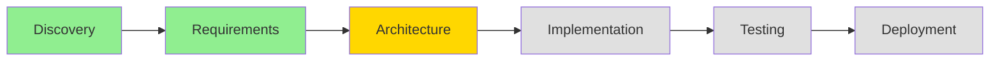

# Workflow Status Task

## Purpose
Display comprehensive workflow position, progress metrics, and visual indicators to help users understand their current state and trajectory within standard workflows.

## Behavioral Requirements

This task instructs LLMs to provide clear, visual workflow status that includes:
- Current position in workflow hierarchy
- Progress percentages and time metrics
- Blocker identification and impact
- Comparison to typical performance
- Dependency mapping and critical path

## Progressive Disclosure Levels

### Level 0 (Default): Essential Status
```
📍 Workflow: {workflow_name}
📊 Phase: {current_phase} - {progress}% complete
⏱️ Duration: {time_in_phase} (typical: {typical_duration})
🎯 Next: {next_milestone}
```

### Level 1 (--detailed): Expanded Status
Include phase breakdown, blockers, and team comparison

### Level 2 (--visual): Full Visualization
Complete visual progress with charts and dependency graphs

## Status Calculation Process

### Step 1: Identify Workflow Position
```python
def identify_workflow_position(context_state):
    """Determine exact position in workflow hierarchy"""
    
    position = {
        "workflow": context_state.active_workflow,
        "phase": context_state.current_phase,
        "sub_phase": context_state.current_sub_phase,
        "task": context_state.current_task,
        "started": context_state.phase_start_time,
        "last_activity": context_state.last_activity_time
    }
    
    # Load workflow definition
    workflow_def = load_workflow_definition(position.workflow)
    
    # Calculate position in hierarchy
    position["phase_index"] = get_phase_index(workflow_def, position.phase)
    position["total_phases"] = len(workflow_def.phases)
    position["tasks_in_phase"] = count_phase_tasks(workflow_def, position.phase)
    position["completed_tasks"] = count_completed_tasks(context_state)
    
    return position, workflow_def
```

### Step 2: Calculate Progress Metrics
```python
def calculate_progress_metrics(position, workflow_def, context_state):
    """Calculate detailed progress metrics"""
    
    metrics = {
        # Phase-level progress
        "phase_progress": (position.completed_tasks / position.tasks_in_phase) * 100,
        "phase_duration": time_since(position.started),
        "phase_typical": workflow_def.phases[position.phase].typical_duration,
        
        # Workflow-level progress
        "overall_progress": calculate_overall_progress(position, workflow_def),
        "completed_phases": position.phase_index,
        "remaining_phases": position.total_phases - position.phase_index,
        
        # Velocity metrics
        "velocity": calculate_velocity(context_state),
        "estimated_completion": estimate_completion_date(metrics, velocity)
    }
    
    # Performance comparison
    metrics["performance"] = {
        "vs_typical": metrics.phase_duration / metrics.phase_typical,
        "vs_team_avg": compare_to_team_average(metrics),
        "vs_personal_best": compare_to_personal_best(metrics)
    }
    
    return metrics
```

### Step 3: Identify Blockers and Dependencies
```python
def analyze_blockers_and_dependencies(context_state, workflow_def):
    """Identify what's blocking progress"""
    
    analysis = {
        "blockers": [],
        "dependencies": [],
        "critical_path": []
    }
    
    # Active blockers
    for blocker in context_state.active_blockers:
        blocker_info = {
            "description": blocker.description,
            "severity": assess_blocker_severity(blocker),
            "impact": calculate_blocker_impact(blocker, workflow_def),
            "age": time_since(blocker.created),
            "resolution_suggestions": suggest_resolutions(blocker)
        }
        analysis["blockers"].append(blocker_info)
    
    # Dependencies
    current_phase = workflow_def.phases[context_state.current_phase]
    for dep in current_phase.dependencies:
        dep_status = check_dependency_status(dep, context_state)
        analysis["dependencies"].append({
            "item": dep,
            "status": dep_status,
            "blocking": dep_status != "completed"
        })
    
    # Critical path
    analysis["critical_path"] = calculate_critical_path(
        workflow_def,
        context_state.current_phase
    )
    
    return analysis
```

### Step 4: Generate Visual Progress
```python
def generate_visual_progress(position, metrics, workflow_def):
    """Create visual representation of progress"""
    
    visuals = {
        "phase_bar": create_phase_progress_bar(metrics.phase_progress),
        "workflow_diagram": create_workflow_position_diagram(position, workflow_def),
        "timeline": create_timeline_view(position, metrics),
        "burndown": create_burndown_chart(metrics) if applicable
    }
    
    return visuals
```

## Output Templates

### Basic Status Display
```markdown
📍 **Current Position**
Workflow: {workflow_name}
Phase: {current_phase} ({phase_number}/{total_phases})
Progress: {progress}% complete

⏱️ **Time Metrics**
In Current Phase: {duration}
Typical Duration: {typical_duration}
Status: {ahead_behind_schedule}

🎯 **Next Milestone**
{next_milestone_name} - {estimated_time_to_milestone}
```

### Detailed Status with Visuals
```markdown
# 📊 Workflow Status Report

## Current Position


## Phase Progress
**{current_phase}** Phase Status
```
Progress: [████████░░░░░░░░░░] 45% (9/20 tasks)
Duration: 5 days (typical: 7 days) ✅ On Track
```

### Completed Tasks ✅
- [x] System architecture design
- [x] Technology stack selection
- [x] Database schema design
- [x] API contract definition
- [x] Security architecture
- [x] Deployment architecture
- [x] Performance requirements
- [x] Integration points mapping
- [x] Scalability planning

### In Progress 🔄
- [ ] Frontend architecture (75% complete)
- [ ] Detailed component design (30% complete)

### Upcoming Tasks ⏳
- [ ] Architecture review
- [ ] Final architecture documentation
- [ ] Team architecture walkthrough
- [ ] ... and 6 more

## Overall Workflow Progress
```
[████████████░░░░░░░░░░░░░░░░] 42% Complete

✅ Discovery    (100%) - 3 days
✅ Requirements (100%) - 5 days  
🔄 Architecture ( 45%) - 5 days (in progress)
⏳ Implementation ( 0%) - Estimated 14 days
⏳ Testing       ( 0%) - Estimated 7 days
⏳ Deployment    ( 0%) - Estimated 3 days
```

## Performance Metrics
| Metric | Current | Typical | Team Avg | Your Best |
|--------|---------|---------|----------|-----------|
| Phase Velocity | 1.8 tasks/day | 2.0 tasks/day | 1.9 tasks/day | 2.3 tasks/day |
| Time in Phase | 5 days | 7 days | 6.5 days | 4 days |
| Overall Progress | 42% | 45% | 43% | 48% |

## Blockers & Dependencies 🚧

### Active Blockers (2)
1. **Waiting for security review**
   - Severity: Medium
   - Age: 2 days
   - Impact: Blocking 3 downstream tasks
   - Action: Follow up with security team

2. **Database hosting decision pending**
   - Severity: High
   - Age: 1 day
   - Impact: Blocking infrastructure setup
   - Action: Schedule decision meeting

### Dependencies
- ✅ Requirements approval (Completed)
- ✅ Stakeholder sign-off (Completed)
- 🔄 Security review (In Progress)
- ⏳ Infrastructure provisioning (Waiting)

## Estimated Timeline
Based on current velocity and typical patterns:

**Phase Completion**: ~ 3 more days
**Overall Completion**: ~ 25 days
**Confidence**: 75% (based on 12 similar projects)

## Recommendations
Based on your current position and velocity:

1. 🎯 **Focus on unblocking** security review to prevent cascade delays
2. 🚀 **Opportunity**: Parallel work on component design while waiting
3. ⚠️ **Risk**: Database decision could impact architecture - escalate

## Quick Actions
- `/workflow suggest` - Get specific next step recommendations
- `/handoff architect` - If switching contexts
- `/blocker-resolution security-review` - Get resolution help
```

### Visual Progress Indicators

#### Phase Progress Bar
```
Current Phase: Implementation
[████████████░░░░░░] 65% | 13/20 tasks | 5d elapsed | 2d remaining
```

#### Workflow Timeline
```
Week 1    Week 2    Week 3    Week 4    Week 5
[===✓===][===✓===][==🔄---][-⏳----][-⏳----]
Discovery  Require  Architect  Implement  Test/Deploy
(complete) (complete) (current)  (future)   (future)
```

#### Velocity Chart
```
Tasks/Day
  3 |     *
  2 |   *   * ← Current
  1 | *       *
  0 +---+---+---+---+
    D1  D2  D3  D4  D5
```

## Comparison Modes

### Compare to Typical
```markdown
## Performance vs Typical

**Current Phase Duration**: 5 days
**Typical Duration**: 7 days
**Status**: 🟢 29% faster than typical

**Overall Progress**: 42%
**Typical at This Time**: 38%
**Status**: 🟢 Ahead of schedule

Key Differences:
- ✅ Faster requirements gathering (+2 days)
- ✅ Efficient architecture decisions (+1 day)
- ⚠️ Risk: Rushing may impact quality
```

### Compare to Team Average
```markdown
## Performance vs Team

Your performance relative to team average:
- Phase Velocity: 95% of team average
- Decision Speed: 110% of team average
- Blocker Resolution: 85% of team average

Insights:
- You excel at making quick decisions
- Consider focusing on blocker resolution
- Your quality metrics are above average
```

### Compare to Personal Best
```markdown
## Performance vs Your Best

Comparing to your best project (Project X):
- Current Velocity: 78% of your best
- Phase Efficiency: 82% of your best
- Quality Score: 95% of your best

Factors affecting performance:
- Team size difference (5 vs 3 people)
- Technology complexity higher
- More stakeholders involved
```

## Status Edge Cases

### No Active Workflow
```markdown
⚠️ No Active Workflow

You're not currently in a standard workflow.

Recent Activity:
- Last workflow: {workflow_name}
- Completed: {completion_date}
- Duration: {total_duration}

Options:
1. Start new workflow: `/workflow start [name]`
2. Resume custom work
3. View workflow history: `/workflow history`
```

### Multiple Workflows
```markdown
🔀 Multiple Active Workflows Detected

1. **{workflow_1}** - Primary
   - Phase: {phase} ({progress}%)
   - Last activity: {time_ago}

2. **{workflow_2}** - Secondary
   - Phase: {phase} ({progress}%)
   - Last activity: {time_ago}

Showing status for primary workflow.
Use `/workflow status --workflow={name}` for specific workflow.
```

### Stalled Workflow
```markdown
⚠️ Workflow Stalled

**{workflow_name}** - No activity for {days} days
**Last Phase**: {phase} ({progress}% complete)
**Last Activity**: {last_activity}

Possible Reasons:
1. Blocked by: {blockers}
2. Waiting for: {dependencies}
3. Context switch to other priorities

Recommendations:
- Review blockers: `/blocker list`
- Resume workflow: `/workflow resume`
- Close workflow: `/workflow close --reason="{reason}"`
```

## Memory Integration

### Historical Patterns
When showing status, include relevant historical insights:
- "Teams typically slow down 20% in this phase"
- "Your past projects accelerated after architecture phase"
- "This blocker type usually takes 2-3 days to resolve"

### Predictive Insights
Use memory to predict likely scenarios:
- "Based on current velocity, 78% chance of on-time completion"
- "Similar projects experienced delays at testing phase"
- "Your team performs best with 2-day sprints in this phase"

## Analytics Integration

Track and learn from status queries:
- Which metrics users check most
- Correlation between status checks and productivity
- Optimal reminder frequency for stalled workflows

## Behavioral Guidance for LLM

When displaying workflow status:

1. **Be visual**: Use progress bars, charts, and diagrams
2. **Be specific**: Show exact numbers, not vague statements
3. **Be comparative**: Always provide context via comparisons
4. **Be actionable**: Include what to do next
5. **Be honest**: Show both positive and negative trends
6. **Be predictive**: Use patterns to forecast completion
7. **Be adaptive**: Adjust detail level to user needs

## Error Handling

### Invalid Workflow State
```markdown
❌ Workflow State Error

The workflow state appears corrupted or incomplete.

Attempting recovery...
- Last known good state: {timestamp}
- Data integrity check: {status}

Options:
1. Restore from checkpoint: `/workflow restore`
2. Rebuild from memory: `/workflow rebuild`
3. Start fresh: `/workflow reset`
```

### Metric Calculation Errors
```markdown
⚠️ Some metrics unavailable

Unable to calculate:
- {metric_1}: {reason}
- {metric_2}: {reason}

Showing available metrics only.
Run `/workflow diagnose` for detailed analysis.
```