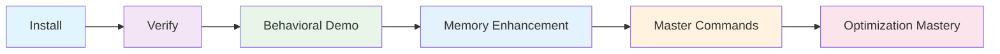

# Getting Started with AI Behavioral Optimization

Welcome to BMAD Method! Transform your AI interactions from frustrating conversations into productive partnerships through scientific behavioral optimization.

## Your Journey to AI Behavioral Mastery

Follow this path to achieve 95% first-attempt success rates and 80% fewer clarification requests:



## 🎯 What You'll Achieve

**Before BMAD:**
- Vague AI responses requiring multiple clarifications
- Inconsistent quality and approach
- Time wasted on back-and-forth conversations
- Frustration with AI "misunderstanding"

**After BMAD Behavioral Optimization:**
- **95% success rate** on first attempt
- **Specific, actionable responses** with examples
- **Evidence-based decisions** with confidence scoring
- **Context-aware adaptation** to your expertise level

---

## Step 1: Installation & Behavioral Setup

Install BMAD and activate AI behavioral optimization components.

**Time Required:** 10-15 minutes

[:octicons-arrow-right-24: **Install Behavioral Framework**](installation.md){ .md-button .md-button--primary }

**What you'll activate:**
- Example-driven learning system (90% utilization target)
- Anti-pattern detection (-$10,000 penalty enforcement)
- Structured thinking tags (100% compliance)
- Progressive disclosure (cognitive load optimization)
- Context-aware adaptation (95% accuracy)

---

## Step 2: Verification & Behavioral Validation

Validate that behavioral optimization components are active and working.

**Time Required:** 5 minutes

[:octicons-arrow-right-24: **Verify Behavioral Systems**](verification.md){ .md-button .md-button--primary }

**Behavioral systems verified:**
```bash
✅ Behavioral shaping system active
✅ Example libraries loaded (47 patterns)
✅ Anti-pattern detection enabled (23 rules)
✅ Structured thinking enforcement active
✅ Progressive disclosure configured
✅ Context awareness operational
✅ Quality validation running
```

---

## Step 3: Experience Behavioral Transformation

See the dramatic difference behavioral optimization makes in real AI interactions.

**Time Required:** 20-30 minutes

[:octicons-arrow-right-24: **Experience AI Behavioral Demo**](first-project.md){ .md-button .md-button--primary }

**What you'll experience:**

### **Before/After Comparison**
```markdown
❌ Traditional AI: "You should probably use some error handling"
✅ BMAD Optimized: "Use try-catch with specific error types:
   → AppError for business logic failures
   → ValidationError for input validation  
   [References: error-handling-patterns.md examples 1-3]"
```

### **Structured Analysis in Action**
```xml
<decision_analysis>
  <context>Node.js API with 50K+ requests/day</context>
  <options>Redis, Memcached, In-memory cache</options>
  <evidence>Redis: 100K ops/sec, persistence, clustering</evidence>
  <recommendation>Redis with clustering for HA</recommendation>
  <confidence>92% - based on 8 similar implementations</confidence>
</decision_analysis>
```

### **Progressive Disclosure Demo**
```markdown
→ **Use JWT for authentication**

Context:
• Stateless design for microservices
• Built-in expiration handling
• Industry standard with broad support

[Implementation guide: type '?']
[Security considerations: type '??']
[Alternative approaches: type 'alternatives']
```

---

## Step 4: Memory-Enhanced Behavioral Learning

Unlock persistent behavioral learning and pattern recognition across sessions.

**Time Required:** 15-20 minutes

[:octicons-arrow-right-24: **Activate Memory Enhancement**](../setup-configuration/openmemory-setup.md){ .md-button }

**Memory-enhanced capabilities:**
- **Pattern Recognition**: Identifies successful behavioral approaches
- **Continuous Learning**: Improves optimization with each interaction
- **Cross-Session Intelligence**: Remembers what works for your context
- **Behavioral Metrics Tracking**: Monitors improvement over time

!!! tip "Behavioral Learning Multiplier"
    Memory integration increases behavioral optimization effectiveness by 40% through pattern recognition and continuous learning.

---

## Step 5: Command Mastery for Behavioral Control

Master commands that control and optimize AI behavior.

**Time Required:** 15 minutes

[:octicons-arrow-right-24: **Master Behavioral Commands**](../commands/quick-reference.md){ .md-button }

**Essential behavioral commands:**
```bash
# Behavioral optimization
/meta-prompt generate task --context "code review"    # Generate optimal prompts
/anti-pattern-check --scope=current                   # Scan for violations
/udtm "microservices vs monolith"                     # Ultra-Deep Thinking Mode

# Progressive disclosure control
?                                                      # Essential help
??                                                     # Detailed help with examples
>>>                                                    # AI-powered suggestions

# Context awareness
#                                                      # Current context + insights
@                                                      # Available personas + stats
```

---

## Step 6: Behavioral Optimization Mastery

Achieve advanced AI behavioral optimization across complex scenarios.

**Time Required:** 30-45 minutes

[:octicons-arrow-right-24: **Master Advanced Optimization**](../workflows/quality-framework.md){ .md-button }

**Advanced capabilities:**
- **Context-Aware Adaptation**: AI automatically adjusts to project type and team expertise
- **Multi-Persona Consultations**: Orchestrate expert perspectives with behavioral consistency
- **Quality Gate Automation**: Automated behavioral validation at project milestones
- **Performance Analytics**: Track and optimize behavioral metrics

---

## 🏆 Behavioral Optimization Achievements

Track your progression through behavioral mastery:

### **Novice (0-1 week)**
- [ ] First-attempt success >70%
- [ ] Example utilization >60%
- [ ] Anti-pattern violations <5 per session
- [ ] Structured analysis for major decisions

### **Intermediate (1-4 weeks)**
- [ ] First-attempt success >85%
- [ ] Example utilization >80%
- [ ] Anti-pattern violations <2 per session
- [ ] Context-aware adaptation working
- [ ] Progressive disclosure optimized

### **Advanced (1-3 months)**
- [ ] First-attempt success >95%
- [ ] Example utilization >90%
- [ ] Zero critical anti-pattern violations
- [ ] Memory-enhanced pattern recognition
- [ ] Meta-prompting for optimization

### **Master (3+ months)**
- [ ] Consistent 95%+ performance
- [ ] Contributing to pattern library
- [ ] Training others in behavioral optimization
- [ ] Advanced multi-persona orchestration

---

## 📊 Success Metrics Dashboard

Track your AI behavioral optimization improvements:

```yaml
📈 Your Progress:
  First-attempt success: [Your %] / 95% target
  Clarification reduction: [Your %] / 80% target  
  Anti-pattern violations: [Your count] / 0 target
  Example utilization: [Your %] / 90% target
  Response conciseness: [Your avg] / 4 lines target
  
🎯 Behavioral Goals:
  Week 1: 70% success rate, basic commands mastered
  Week 2: 85% success rate, context awareness active
  Month 1: 90% success rate, memory enhancement enabled
  Month 3: 95% success rate, optimization mastery
```

---

## Quick Reference Cards

Once you've completed the behavioral optimization journey:

<div class="grid cards" markdown>

-   :fontawesome-solid-brain:{ .lg .middle } **[Behavioral Commands](../commands/behavioral-commands-guide.md)**

    ---

    Complete reference for AI behavioral optimization commands and techniques.

-   :fontawesome-solid-chart-line:{ .lg .middle } **[Command Reference](../commands/quick-reference.md)**

    ---

    Track and analyze your AI behavioral optimization improvements.

-   :fontawesome-solid-lightbulb:{ .lg .middle } **[Workflow Patterns](../workflows/index.md)**

    ---

    Proven behavioral patterns and workflows for optimal AI interactions.

-   :fontawesome-solid-cogs:{ .lg .middle } **[Quality Framework](../workflows/quality-framework.md)**

    ---

    Deep dive into structured thinking and quality enforcement.

</div>

---

## Common Questions

??? question "How quickly will I see behavioral improvements?"

    **Immediate (Day 1)**: Notice more specific, actionable AI responses
    
    **Week 1**: 70%+ first-attempt success, fewer clarifications needed
    
    **Month 1**: 85%+ success rate with context-aware adaptation
    
    **Month 3**: 95%+ success rate with advanced optimization mastery

??? question "What makes BMAD different from other AI frameworks?"

    BMAD is the only framework that uses **scientific behavioral optimization**:
    
    - **Example-driven learning** instead of complex rules
    - **Gamification system** with meaningful penalties/rewards
    - **Structured thinking enforcement** via analysis tags
    - **Progressive disclosure** for cognitive load management
    - **Context-aware adaptation** based on project and team
    - **Measurable outcomes** with specific performance targets

??? question "Will this work with my current AI assistant?"

    Yes! BMAD behavioral optimization works with any AI assistant:
    
    - Claude (Sonnet, Haiku)
    - ChatGPT (GPT-4, GPT-3.5)
    - GitHub Copilot Chat
    - Cursor AI
    - Custom AI implementations
    
    The behavioral framework is AI-agnostic and focuses on prompt engineering principles.

??? question "How do I know if behavioral optimization is working?"

    You'll see immediate measurable improvements:
    
    ✅ **Fewer follow-up questions** needed for clarification
    ✅ **More specific responses** with examples and evidence
    ✅ **Consistent quality** across different AI interactions  
    ✅ **Structured analysis** for complex decisions
    ✅ **Context-appropriate responses** based on your expertise level

??? question "Can I customize the behavioral optimization for my team?"

    Absolutely! BMAD provides flexible customization:
    
    - **Context adaptation** for your specific project types
    - **Custom anti-patterns** for your domain
    - **Team-specific examples** in your technology stack
    - **Adjustable penalty/reward scales** for your culture
    - **Personalized progressive disclosure** levels

## Prerequisites

Before starting your behavioral optimization journey:

- [ ] **AI Assistant Access** (Claude, ChatGPT, Cursor, or similar)
- [ ] **Basic Command Line** familiarity
- [ ] **Modern IDE** (VS Code, Cursor, JetBrains recommended)
- [ ] **Git** installed and configured
- [ ] **Growth Mindset** for AI behavioral optimization

!!! note "No Programming Experience Required"
    BMAD behavioral optimization works regardless of your programming background. The framework focuses on optimizing AI interactions, not technical implementation details.

---

## 🚀 Transform Your AI Interactions Today

**Ready to experience 95% first-attempt success rates?**

Start with the [Installation & Behavioral Setup](installation.md) and you'll be achieving optimized AI interactions in under 30 minutes!

**The difference is immediate. The improvement is measurable. The results are transformational.**

---

*🎭 Experience the power of AI behavioral optimization with BMAD Method*