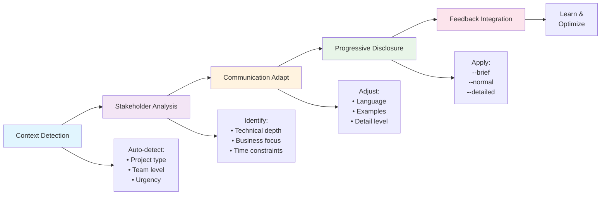

# BMad Method Workflows

Master the core workflows that make BMad Method effective for building "something right that lasts" in the shortest amount of time.

!!! tip "Workflow Mastery"
    The BMad Method's power comes from systematic workflows that integrate persona expertise with quality standards. These workflows ensure consistent excellence across all your projects.

## Core Workflow Components

BMad Method workflows center around two fundamental systems that work together to ensure project success:

### 🎯 **Persona Selection & Handoffs**
Strategic use of specialized personas ensures the right expertise is applied at the right time. Learn how to:
- Choose the optimal persona for any situation
- Execute smooth handoffs between personas
- Avoid common persona selection anti-patterns
- Build effective persona workflows for different project phases

**[Master Persona Selection →](persona-selection.md)**

### ✅ **Quality Framework & Standards**
Comprehensive quality system ensures every deliverable meets BMad Method's high standards. Understand:
- Five-gate quality validation process
- Ultra-Deep Thinking Mode (UDTM) protocol
- Brotherhood Review peer collaboration system
- Daily quality integration practices

**[Learn Quality Framework →](quality-framework.md)**

## Workflow Integration Patterns

### **Discovery to Delivery Pattern**
Complete project workflow from initial idea to production deployment:

```mermaid
graph TD
    A[Project Discovery] --> B[Requirements Analysis]
    B --> C[Strategic Planning]
    C --> D[Technical Design]
    D --> E[Implementation]
    E --> F[Quality Validation]
    F --> G[Production Deployment]
    
    A --> A1[/analyst<br/>Quality Gate 1]
    B --> B1[/pm<br/>UDTM Analysis]
    C --> C1[/architect<br/>Design Review]
    D --> D1[/dev<br/>Quality Gate 3]
    E --> E1[/quality<br/>Brotherhood Review]
    F --> F1[/consult<br/>Quality Gate 5]
    
    style A fill:#e1f5fe
    style B fill:#f3e5f5
    style C fill:#e8f5e8
    style D fill:#fff3e0
    style E fill:#fce4ec
    style F fill:#f1f8e9
    style G fill:#fef7e0
```

### **Problem Resolution Pattern**
Systematic approach to identifying, analyzing, and resolving issues:

```mermaid
graph TD
    A[Issue Identification] --> B[Problem Analysis]
    B --> C[Solution Design]
    C --> D[Implementation]
    D --> E[Validation]
    E --> F[Learning Integration]
    
    A --> A1[/diagnose<br/>System Assessment]
    B --> B1[/patterns<br/>UDTM Protocol]
    C --> C1[/consult<br/>Multi-Persona Review]
    D --> D1[/dev<br/>Quality-Guided Fix]
    E --> E1[/quality<br/>Comprehensive Testing]
    F --> F1[/learn<br/>Pattern Documentation]
    
    style A fill:#ffebee
    style B fill:#fff3e0
    style C fill:#e8f5e8
    style D fill:#e1f5fe
    style E fill:#f3e5f5
    style F fill:#fef7e0
```

### **Continuous Improvement Pattern**
Ongoing optimization of processes, quality, and team effectiveness:

```mermaid
graph TD
    A[Current State Assessment] --> B[Pattern Analysis]
    B --> C[Improvement Identification]
    C --> D[Solution Implementation]
    D --> E[Impact Measurement]
    E --> F[Learning Documentation]
    F --> A
    
    A --> A1[/context<br/>State Review]
    B --> B1[/patterns<br/>Trend Analysis]
    C --> C1[/insights<br/>Opportunity ID]
    D --> D1[/sm<br/>Process Change]
    E --> E1[/quality<br/>Metrics Review]
    F --> F1[/remember<br/>Knowledge Capture]
    
    style A fill:#e8f5e8
    style B fill:#f1f8e9
    style C fill:#fff3e0
    style D fill:#e1f5fe
    style E fill:#f3e5f5
    style F fill:#fef7e0
```

## Advanced Behavioral Workflows 🧠

### **Meta-Prompted Excellence Pattern**
Leverage AI prompt engineering for optimal outcomes:

```mermaid
graph LR
    A[Task Identification] --> B[Meta-Prompt Generation]
    B --> C[Prompt Testing]
    C --> D[Effectiveness Measure]
    D --> E[Pattern Library Update]
    E --> F[Continuous Optimization]
    
    B --> B1[/meta-prompt generate<br/>Context-aware creation]
    C --> C1[/meta-prompt test<br/>Validate effectiveness]
    D --> D1[/behavioral-report<br/>Track improvements]
    E --> E1[/meta-prompt patterns<br/>Share success]
    
    style A fill:#e8f5e8
    style B fill:#f3e5f5
    style C fill:#fff3e0
    style D fill:#e1f5fe
    style E fill:#fce4ec
    style F fill:#f1f8e9
```

**Key Commands**: `/meta-prompt generate` → `/meta-prompt test` → `/behavioral-report`

### **Behavioral Excellence Tracking Pattern**
Monitor and improve AI interaction quality:

```mermaid
graph TD
    A[Daily Work] --> B[Performance Tracking]
    B --> C[Achievement Progress]
    C --> D[Streak Management]
    D --> E[Weekly Analysis]
    E --> F[Improvement Planning]
    
    A --> A1[Regular interactions<br/>with quality focus]
    B --> B1[/balance<br/>Monitor score]
    C --> C1[/achievements<br/>Track progress]
    D --> D1[/streaks<br/>Maintain consistency]
    E --> E1[/behavioral-report<br/>Analyze patterns]
    F --> F1[Apply learnings<br/>to future work]
    
    style A fill:#e8f5e8
    style B fill:#f3e5f5
    style C fill:#fff3e0
    style D fill:#fce4ec
    style E fill:#e1f5fe
    style F fill:#f1f8e9
```

**Key Commands**: `/balance` → `/achievements` → `/streaks` → `/behavioral-report`

### **Context-Adaptive Development Pattern**
Dynamic behavior adjustment for optimal outcomes:



**Key Modifiers**: `--brief` | `--normal` | `--detailed` | `--expert`

## Workflow Success Indicators

### **Process Efficiency Metrics**
- **Persona Switching Frequency**: Optimal range of 2-4 persona changes per work session
- **Quality Gate Pass Rate**: >90% of work passing quality gates on first attempt
- **Handoff Completeness**: Clear context transfer in >95% of persona handoffs
- **Memory Utilization**: Regular use of `/remember` and `/recall` for continuity

### **Quality Achievement Metrics**
- **Standards Compliance**: 100% adherence to defined quality standards
- **Review Effectiveness**: >80% of issues caught in reviews vs. production
- **UDTM Application**: Systematic analysis for all major decisions
- **Brotherhood Engagement**: Active peer collaboration and knowledge sharing

### **Learning & Improvement Metrics**
- **Pattern Recognition**: Identification and documentation of successful patterns
- **Anti-Pattern Avoidance**: Reduced occurrence of documented anti-patterns
- **Knowledge Sharing**: Regular documentation of lessons learned
- **Process Evolution**: Continuous refinement based on experience

## Quick Start Workflow Guide

### **For New Projects**
1. **Start with Analysis**: Begin every project with `/analyst` for deep requirements understanding
2. **Apply Quality Gates**: Ensure each quality gate is properly executed before advancing
3. **Use Structured Handoffs**: Always use `/handoff` with context documentation
4. **Integrate Learning**: Capture insights with `/remember` and `/learn` throughout

### **For Problem Solving**
1. **Systematic Diagnosis**: Use `/diagnose` and `/patterns` to understand the issue
2. **Apply UDTM Protocol**: Use comprehensive analysis for complex problems
3. **Leverage Brotherhood Reviews**: Get peer perspective on solutions
4. **Document Resolution**: Capture solution patterns for future reference

### **For Continuous Improvement**
1. **Regular Pattern Analysis**: Use `/patterns` to identify improvement opportunities
2. **Quality Reflection**: Regular quality assessment and process optimization
3. **Knowledge Documentation**: Systematic capture of learnings and best practices
4. **Process Evolution**: Adapt workflows based on experience and outcomes

## Common Workflow Challenges

### **Challenge: Context Loss During Persona Switches**
**Symptoms**: Repeated work, inconsistent decisions, confused direction
**Solution**: 
- Always use `/remember` before switching personas
- Use `/handoff` instead of direct persona switching
- Start new persona sessions with `/context` and `/recall`

### **Challenge: Quality Gate Failures**
**Symptoms**: Rework required, delayed deliveries, quality issues
**Solution**:
- Implement quality checks throughout development, not just at gates
- Use Brotherhood Reviews for early quality validation
- Apply UDTM protocol for complex quality decisions

### **Challenge: Inconsistent Process Application**
**Symptoms**: Variable quality, missed steps, team confusion
**Solution**:
- Document team-specific workflow patterns
- Regular workflow retrospectives and refinement
- Clear workflow training and reference materials

### **Challenge: Learning Not Captured**
**Symptoms**: Repeated mistakes, no process improvement, knowledge loss
**Solution**:
- Systematic use of `/learn` and `/remember` commands
- Regular pattern documentation and sharing
- Post-project retrospectives with workflow analysis

## Workflow Resources

### **Getting Started**
- [Your First Project](../getting-started/first-project.md) - Practice basic workflows
- [Command Quick Reference](../commands/quick-reference.md) - Essential commands for workflows
- [Advanced Search](../commands/advanced-search.md) - Find the right commands for any situation

### **Deep Dive Resources**
- [Persona Selection Guide](persona-selection.md) - Master strategic persona usage
- [Quality Framework](quality-framework.md) - Comprehensive quality system
- [Personas Reference](../reference/personas.md) - Detailed persona capabilities

### **Best Practices**
- **Start Simple**: Begin with basic workflows and add complexity gradually
- **Be Consistent**: Apply workflows consistently across all projects
- **Measure Impact**: Track workflow effectiveness and iterate based on results
- **Share Learning**: Document and share successful workflow patterns with team

---

**Ready to dive deeper?**
- [Master Persona Selection →](persona-selection.md)
- [Learn Quality Framework →](quality-framework.md)
- [Practice with First Project →](../getting-started/first-project.md) 