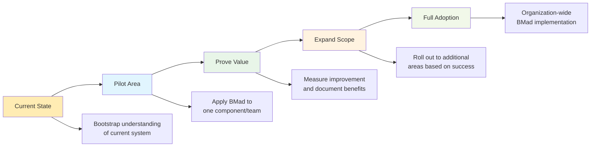
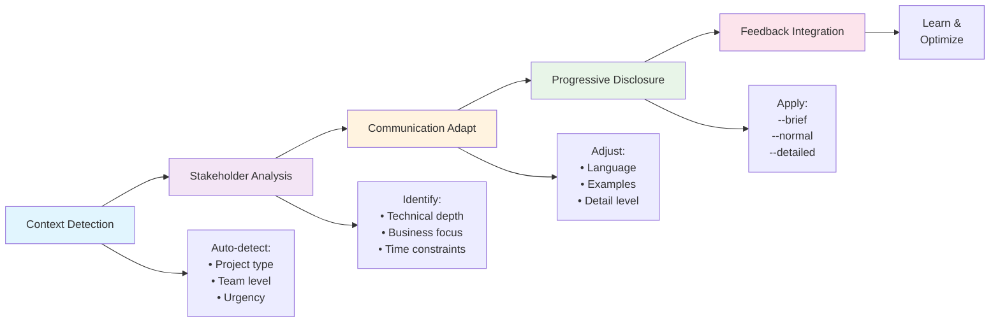

# BMad Method Workflows

Master the core workflows that make BMad Method effective for building "something right that lasts" in the shortest amount of time.

!!! tip "Workflow Mastery"
    The BMad Method's power comes from systematic workflows that integrate persona expertise with quality standards. These workflows ensure consistent excellence across all your projects.

## Core Workflow Components

BMad Method workflows center around two fundamental systems that work together to ensure project success:

### 🎯 **Persona Selection & Handoffs**
Strategic use of specialized personas ensures the right expertise is applied at the right time. Learn how to:
- Choose the optimal persona for any situation
- Execute smooth handoffs between personas
- Avoid common persona selection anti-patterns
- Build effective persona workflows for different project phases

**[Master Persona Selection →](persona-selection.md)**

### ✅ **Quality Framework & Standards**
Comprehensive quality system ensures every deliverable meets BMad Method's high standards. Understand:
- Five-gate quality validation process
- Ultra-Deep Thinking Mode (UDTM) protocol
- Brotherhood Review peer collaboration system
- Daily quality integration practices

**[Learn Quality Framework →](quality-framework.md)**

## Brownfield Project Initialization 🏗️

!!! info "Starting with Existing Codebases"
    Most real-world projects begin with existing code, systems, and technical debt. BMad Method provides systematic approaches for brownfield initialization.

### Understanding Brownfield vs Greenfield

**🌱 Greenfield Projects**
- Starting from scratch with clean slate
- Can establish BMad standards from day one
- Full control over architecture and quality from start

**🏗️ Brownfield Projects**  
- Working with existing codebase and systems
- Must understand current state before applying BMad
- Gradual adoption with respect for existing constraints
- Memory bootstrapping critical for capturing existing knowledge

### Brownfield Initialization Workflow

#### **Phase 1: System Assessment & Memory Bootstrap**

```mermaid
graph TD
    A[Existing Codebase] --> B[Initial Assessment]
    B --> C[Memory Bootstrap]
    C --> D[Pattern Recognition]
    D --> E[Quality Baseline]
    E --> F[Improvement Planning]
    
    B --> B1[/analyst<br/>Codebase analysis]
    C --> C1[/memory bootstrap-memory<br/>--mode=auto --depth=deep]
    D --> D1[/patterns<br/>--type=technical --context=current]
    E --> E1[/quality quality-gate<br/>current-state assessment]
    F --> F1[/pm<br/>Improvement roadmap]
    
    style A fill:#ffecb3
    style B fill:#e1f5fe
    style C fill:#f3e5f5
    style D fill:#e8f5e8
    style E fill:#fff3e0
    style F fill:#fce4ec
```

**Step 1: Initial System Analysis**
```bash
# For Claude Code
/project:system init --config --memory
/project:persona analyst
/project:analysis diagnose --component=all --deep

# For Regular IDE
bmad analyst
bmad diagnose --component=all --deep
```

**Step 2: Comprehensive Memory Bootstrap**
```bash
# For Claude Code - Bootstrap from existing codebase
/project:memory bootstrap-memory --mode=auto --focus=all --depth=deep

# For Regular IDE
bmad bootstrap-memory --mode=auto --focus=all --depth=deep
```

**Step 3: Pattern Recognition & Documentation**
```bash
# For Claude Code
/project:memory patterns --type=all --context=current
/project:memory insights --focus=architecture --actionable

# For Regular IDE  
bmad patterns --type=all --context=current
bmad insights --focus=architecture --actionable
```

#### **Phase 2: Quality Baseline & Standards Assessment**

**Step 4: Current Quality Assessment**
```bash
# For Claude Code
/project:quality quality-gate custom --strict=false --report
/project:quality anti-pattern-check --scope=all --severity=all

# For Regular IDE
bmad quality-gate custom --strict=false --report
bmad anti-pattern-check --scope=all --severity=all
```

**Step 5: Technical Debt Documentation**
```bash
# For Claude Code
/project:memory remember "Technical debt analysis: [findings]" --category=issues --priority=high
/project:memory remember "Current architecture patterns: [patterns]" --category=patterns

# For Regular IDE
bmad remember "Technical debt analysis: [findings]" --category=issues --priority=high
bmad remember "Current architecture patterns: [patterns]" --category=patterns
```

#### **Phase 3: Strategic Planning & Roadmap**

**Step 6: Improvement Strategy Development**
```bash
# For Claude Code
/project:persona pm
/project:consultation consult product-strategy
/project:quality udtm "brownfield improvement approach" --perspectives=5

# For Regular IDE
bmad pm
bmad consult product-strategy  
bmad udtm "brownfield improvement approach" --perspectives=5
```

**Step 7: Implementation Roadmap**
```bash
# For Claude Code
/project:persona po
/project:workflow tasks --category=quality --recommended
/project:memory remember "Brownfield improvement roadmap: [plan]" --category=decisions

# For Regular IDE
bmad po
bmad tasks --category=quality --recommended
bmad remember "Brownfield improvement roadmap: [plan]" --category=decisions
```

### Bootstrap Memory Command Deep Dive

The `/project:memory bootstrap-memory` command is specifically designed for brownfield projects to automatically capture existing codebase knowledge.

#### **Bootstrap Modes**

##### **Auto Mode (Recommended for Most Projects)**
```bash
# For Claude Code
/project:memory bootstrap-memory --mode=auto --depth=standard
```

**What It Does**:
- Automatically scans codebase structure and patterns
- Identifies common architectural decisions
- Captures existing naming conventions and code patterns  
- Documents current technology stack and dependencies
- Maps data flows and system integrations

**Best For**: Well-structured codebases with clear patterns

##### **Interactive Mode (Best for Complex Systems)**
```bash
# For Claude Code  
/project:memory bootstrap-memory --mode=interactive --focus=architecture
```

**What It Does**:
- Guided discovery process with questions and clarifications
- Human input on business context and historical decisions
- Collaborative identification of critical system components
- Validation of discovered patterns and assumptions

**Best For**: Complex systems where context matters more than code structure

##### **Guided Mode (Best for Teams New to BMAD)**
```bash
# For Claude Code
/project:memory bootstrap-memory --mode=guided --depth=shallow
```

**What It Does**:
- Step-by-step process with explanations
- Training on what to look for and document
- Template-based capture of key information
- Built-in quality checks and validation

**Best For**: Teams learning BMAD Method while working on brownfield projects

#### **Bootstrap Focus Areas**

##### **Architecture Focus**
```bash
/project:memory bootstrap-memory --focus=architecture --depth=deep
```
**Captures**:
- System architecture patterns and decisions
- Component relationships and dependencies
- Data flow and integration patterns
- Performance bottlenecks and optimization opportunities

##### **Decisions Focus**
```bash
/project:memory bootstrap-memory --focus=decisions --depth=standard  
```
**Captures**:
- Historical technical decisions and rationale
- Technology choices and trade-offs made
- Process decisions and workflow patterns
- Quality standards and practices in use

##### **Patterns Focus**
```bash
/project:memory bootstrap-memory --focus=patterns --depth=standard
```
**Captures**:
- Code patterns and conventions in use
- Successful implementation patterns
- Anti-patterns currently present in codebase
- Naming conventions and style guidelines

##### **Issues Focus**
```bash
/project:memory bootstrap-memory --focus=issues --depth=deep
```
**Captures**:
- Known bugs and technical debt
- Performance issues and bottlenecks  
- Security vulnerabilities and concerns
- Maintenance pain points and challenges

#### **Depth Levels**

##### **Shallow Analysis** 
- Quick overview of major components
- High-level architecture understanding
- Critical issues identification
- Basic pattern recognition

##### **Standard Analysis**
- Comprehensive component analysis
- Detailed architecture documentation
- Pattern and anti-pattern identification
- Quality assessment and recommendations

##### **Deep Analysis**
- Line-by-line code analysis where relevant
- Historical git analysis for decision context
- Performance profiling and optimization opportunities
- Security audit and vulnerability assessment

### Brownfield Success Patterns

#### **The Gradual Adoption Pattern**


**Key Commands**: `/memory bootstrap-memory` → `/patterns` → `/quality quality-gate` → `/learn`

#### **The Technical Debt Reduction Pattern**
```mermaid
graph TD
    A[Debt Assessment] --> B[Priority Matrix]
    B --> C[Incremental Fixes]
    C --> D[Quality Measurement]
    D --> E[Continuous Improvement]
    
    A --> A1[/quality anti-pattern-check<br/>--scope=all]
    B --> B1[/pm priority analysis<br/>with business impact]
    C --> C1[/dev focused refactoring<br/>with quality gates]
    D --> D1[/quality measurement<br/>and validation]
    E --> E1[/learn and optimize<br/>improvement process]
    
    style A fill:#ffebee
    style B fill:#fff3e0
    style C fill:#e8f5e8
    style D fill:#e1f5fe
    style E fill:#f1f8e9
```

**Key Commands**: `/quality anti-pattern-check` → `/pm` → `/dev` → `/quality` → `/learn`

#### **The Knowledge Capture Pattern**
```mermaid
graph LR
    A[Tribal Knowledge] --> B[Systematic Capture]
    B --> C[Documentation]
    C --> D[Validation]
    D --> E[Knowledge Sharing]
    
    A --> A1[Identify experts and<br/>undocumented knowledge]
    B --> B1[/memory bootstrap-memory<br/>--mode=interactive]
    C --> C1[/remember key insights<br/>and decisions]
    D --> D1[/patterns validation<br/>and refinement]
    E --> E1[/insights sharing<br/>across team]
    
    style A fill:#fff3e0
    style B fill:#e1f5fe
    style C fill:#f3e5f5
    style D fill:#e8f5e8
    style E fill:#f1f8e9
```

**Key Commands**: `/memory bootstrap-memory --mode=interactive` → `/remember` → `/patterns` → `/insights`

### Brownfield Anti-Patterns to Avoid

#### **🚫 Anti-Pattern: Big Bang BMad Adoption**
**What It Looks Like**:
- Trying to implement all BMad practices immediately
- Forcing BMad standards on entire legacy codebase
- Ignoring existing team knowledge and practices

**Why It Fails**:
- Overwhelming for teams
- Doesn't respect existing investments
- Creates resistance to change
- Misses valuable existing knowledge

**Better Approach**:
```bash
# Start with understanding, then gradual improvement
/project:memory bootstrap-memory --mode=interactive
/project:patterns --type=workflow --success-rate=high
# Build on what's working, improve what isn't
```

#### **🚫 Anti-Pattern: Memory Bootstrap Neglect**
**What It Looks Like**:
- Starting BMad without understanding existing system
- Treating brownfield like greenfield project
- Missing valuable historical context and decisions

**Why It Fails**:
- Repeats past mistakes
- Ignores valuable lessons learned
- Misses existing good patterns
- Creates disconnect with team knowledge

**Better Approach**:
```bash
# Always start with comprehensive memory bootstrap
/project:memory bootstrap-memory --mode=auto --focus=all --depth=deep
/project:memory patterns --type=all --context=current
/project:memory insights --focus=all --actionable
```

#### **🚫 Anti-Pattern: Quality Standards Imposition**
**What It Looks Like**:
- Immediately applying strict BMad quality standards
- Failing existing code against new standards
- Not considering existing quality practices

**Why It Fails**:
- Creates massive technical debt overnight
- Demoralizes team with impossible standards
- Ignores existing quality investments
- Prevents progress on new features

**Better Approach**:
```bash
# Assess current state, then improve gradually
/project:quality quality-gate custom --strict=false --report
/project:quality anti-pattern-check --scope=changed --autofix
# Focus on preventing new debt, gradually improve existing
```

### Brownfield Initialization Checklist

#### **Pre-Initialization Assessment**
- [ ] **Codebase Size & Complexity**: Understand scope of what you're working with
- [ ] **Team Knowledge**: Identify team members with historical context
- [ ] **Documentation State**: Assess existing documentation quality and coverage
- [ ] **Quality Current State**: Understand current quality practices and standards
- [ ] **Technical Debt Level**: Get realistic assessment of existing technical debt

#### **Memory Bootstrap Execution**
- [ ] **Bootstrap Mode Selected**: Choose auto/interactive/guided based on project needs
- [ ] **Focus Areas Identified**: Determine which aspects need deepest analysis
- [ ] **Depth Level Chosen**: Balance thoroughness with time constraints
- [ ] **Key Stakeholders Involved**: Include team members with historical knowledge
- [ ] **Bootstrap Results Validated**: Verify captured information is accurate and complete

#### **Quality Baseline Establishment**
- [ ] **Current Standards Documented**: Capture existing quality practices
- [ ] **Quality Gaps Identified**: Understand difference between current and desired state
- [ ] **Improvement Priorities Set**: Focus on most impactful quality improvements first
- [ ] **Quality Metrics Established**: Define how to measure improvement over time
- [ ] **Team Alignment Achieved**: Ensure team understands and supports quality direction

#### **Strategic Planning & Roadmap**
- [ ] **Improvement Strategy Defined**: Clear approach for gradual BMad adoption
- [ ] **Resource Requirements Understood**: Realistic assessment of effort required
- [ ] **Success Metrics Established**: Clear measures of BMad adoption success
- [ ] **Timeline & Milestones Set**: Realistic schedule for improvement implementation
- [ ] **Risk Mitigation Planned**: Address potential challenges and obstacles

### Quick Start Commands for Brownfield

#### **Initial Setup (First 30 Minutes)**
```bash
# For Claude Code
/project:system init --config --memory
/project:memory bootstrap-memory --mode=auto --depth=standard
/project:memory patterns --type=all --context=current

# For Regular IDE
bmad init --config --memory
bmad bootstrap-memory --mode=auto --depth=standard
bmad patterns --type=all --context=current
```

#### **Deep Dive Assessment (First Week)**
```bash
# For Claude Code
/project:memory bootstrap-memory --mode=interactive --focus=all --depth=deep
/project:quality quality-gate custom --strict=false --report
/project:quality anti-pattern-check --scope=all --severity=high
/project:consultation consult quality-assessment

# For Regular IDE
bmad bootstrap-memory --mode=interactive --focus=all --depth=deep
bmad quality-gate custom --strict=false --report
bmad anti-pattern-check --scope=all --severity=high
bmad consult quality-assessment
```

#### **Strategic Planning (End of First Week)**
```bash
# For Claude Code
/project:persona pm
/project:quality udtm "brownfield improvement strategy" --perspectives=7
/project:memory remember "Brownfield assessment results and strategic plan" --category=decisions
/project:consultation consult product-strategy

# For Regular IDE
bmad pm
bmad udtm "brownfield improvement strategy" --perspectives=7
bmad remember "Brownfield assessment results and strategic plan" --category=decisions
bmad consult product-strategy
```

## Workflow Integration Patterns

### **Discovery to Delivery Pattern**
Complete project workflow from initial idea to production deployment:

```mermaid
graph TD
    A[Project Discovery] --> B[Requirements Analysis]
    B --> C[Strategic Planning]
    C --> D[Technical Design]
    D --> E[Implementation]
    E --> F[Quality Validation]
    F --> G[Production Deployment]
    
    A --> A1[/analyst<br/>Quality Gate 1]
    B --> B1[/pm<br/>UDTM Analysis]
    C --> C1[/architect<br/>Design Review]
    D --> D1[/dev<br/>Quality Gate 3]
    E --> E1[/quality<br/>Brotherhood Review]
    F --> F1[/consult<br/>Quality Gate 5]
    
    style A fill:#e1f5fe
    style B fill:#f3e5f5
    style C fill:#e8f5e8
    style D fill:#fff3e0
    style E fill:#fce4ec
    style F fill:#f1f8e9
    style G fill:#fef7e0
```

### **Problem Resolution Pattern**
Systematic approach to identifying, analyzing, and resolving issues:

```mermaid
graph TD
    A[Issue Identification] --> B[Problem Analysis]
    B --> C[Solution Design]
    C --> D[Implementation]
    D --> E[Validation]
    E --> F[Learning Integration]
    
    A --> A1[/diagnose<br/>System Assessment]
    B --> B1[/patterns<br/>UDTM Protocol]
    C --> C1[/consult<br/>Multi-Persona Review]
    D --> D1[/dev<br/>Quality-Guided Fix]
    E --> E1[/quality<br/>Comprehensive Testing]
    F --> F1[/learn<br/>Pattern Documentation]
    
    style A fill:#ffebee
    style B fill:#fff3e0
    style C fill:#e8f5e8
    style D fill:#e1f5fe
    style E fill:#f3e5f5
    style F fill:#fef7e0
```

### **Continuous Improvement Pattern**
Ongoing optimization of processes, quality, and team effectiveness:

```mermaid
graph TD
    A[Current State Assessment] --> B[Pattern Analysis]
    B --> C[Improvement Identification]
    C --> D[Solution Implementation]
    D --> E[Impact Measurement]
    E --> F[Learning Documentation]
    F --> A
    
    A --> A1[/context<br/>State Review]
    B --> B1[/patterns<br/>Trend Analysis]
    C --> C1[/insights<br/>Opportunity ID]
    D --> D1[/sm<br/>Process Change]
    E --> E1[/quality<br/>Metrics Review]
    F --> F1[/remember<br/>Knowledge Capture]
    
    style A fill:#e8f5e8
    style B fill:#f1f8e9
    style C fill:#fff3e0
    style D fill:#e1f5fe
    style E fill:#f3e5f5
    style F fill:#fef7e0
```

## Advanced Behavioral Workflows 🧠

### **Meta-Prompted Excellence Pattern**
Leverage AI prompt engineering for optimal outcomes:

```mermaid
graph LR
    A[Task Identification] --> B[Meta-Prompt Generation]
    B --> C[Prompt Testing]
    C --> D[Effectiveness Measure]
    D --> E[Pattern Library Update]
    E --> F[Continuous Optimization]
    
    B --> B1[/meta-prompt generate<br/>Context-aware creation]
    C --> C1[/meta-prompt test<br/>Validate effectiveness]
    D --> D1[/behavioral-report<br/>Track improvements]
    E --> E1[/meta-prompt patterns<br/>Share success]
    
    style A fill:#e8f5e8
    style B fill:#f3e5f5
    style C fill:#fff3e0
    style D fill:#e1f5fe
    style E fill:#fce4ec
    style F fill:#f1f8e9
```

**Key Commands**: `/meta-prompt generate` → `/meta-prompt test` → `/behavioral-report`

### **Behavioral Excellence Tracking Pattern**
Monitor and improve AI interaction quality:

```mermaid
graph TD
    A[Daily Work] --> B[Performance Tracking]
    B --> C[Achievement Progress]
    C --> D[Streak Management]
    D --> E[Weekly Analysis]
    E --> F[Improvement Planning]
    
    A --> A1[Regular interactions<br/>with quality focus]
    B --> B1[/balance<br/>Monitor score]
    C --> C1[/achievements<br/>Track progress]
    D --> D1[/streaks<br/>Maintain consistency]
    E --> E1[/behavioral-report<br/>Analyze patterns]
    F --> F1[Apply learnings<br/>to future work]
    
    style A fill:#e8f5e8
    style B fill:#f3e5f5
    style C fill:#fff3e0
    style D fill:#fce4ec
    style E fill:#e1f5fe
    style F fill:#f1f8e9
```

**Key Commands**: `/balance` → `/achievements` → `/streaks` → `/behavioral-report`

### **Context-Adaptive Development Pattern**
Dynamic behavior adjustment for optimal outcomes:



**Key Modifiers**: `--brief` | `--normal` | `--detailed` | `--expert`

## Workflow Success Indicators

### **Process Efficiency Metrics**
- **Persona Switching Frequency**: Optimal range of 2-4 persona changes per work session
- **Quality Gate Pass Rate**: >90% of work passing quality gates on first attempt
- **Handoff Completeness**: Clear context transfer in >95% of persona handoffs
- **Memory Utilization**: Regular use of `/remember` and `/recall` for continuity

### **Quality Achievement Metrics**
- **Standards Compliance**: 100% adherence to defined quality standards
- **Review Effectiveness**: >80% of issues caught in reviews vs. production
- **UDTM Application**: Systematic analysis for all major decisions
- **Brotherhood Engagement**: Active peer collaboration and knowledge sharing

### **Learning & Improvement Metrics**
- **Pattern Recognition**: Identification and documentation of successful patterns
- **Anti-Pattern Avoidance**: Reduced occurrence of documented anti-patterns
- **Knowledge Sharing**: Regular documentation of lessons learned
- **Process Evolution**: Continuous refinement based on experience

## Quick Start Workflow Guide

### **For New Projects**
1. **Start with Analysis**: Begin every project with `/analyst` for deep requirements understanding
2. **Apply Quality Gates**: Ensure each quality gate is properly executed before advancing
3. **Use Structured Handoffs**: Always use `/handoff` with context documentation
4. **Integrate Learning**: Capture insights with `/remember` and `/learn` throughout

### **For Problem Solving**
1. **Systematic Diagnosis**: Use `/diagnose` and `/patterns` to understand the issue
2. **Apply UDTM Protocol**: Use comprehensive analysis for complex problems
3. **Leverage Brotherhood Reviews**: Get peer perspective on solutions
4. **Document Resolution**: Capture solution patterns for future reference

### **For Continuous Improvement**
1. **Regular Pattern Analysis**: Use `/patterns` to identify improvement opportunities
2. **Quality Reflection**: Regular quality assessment and process optimization
3. **Knowledge Documentation**: Systematic capture of learnings and best practices
4. **Process Evolution**: Adapt workflows based on experience and outcomes

## Common Workflow Challenges

### **Challenge: Context Loss During Persona Switches**
**Symptoms**: Repeated work, inconsistent decisions, confused direction
**Solution**: 
- Always use `/remember` before switching personas
- Use `/handoff` instead of direct persona switching
- Start new persona sessions with `/context` and `/recall`

### **Challenge: Quality Gate Failures**
**Symptoms**: Rework required, delayed deliveries, quality issues
**Solution**:
- Implement quality checks throughout development, not just at gates
- Use Brotherhood Reviews for early quality validation
- Apply UDTM protocol for complex quality decisions

### **Challenge: Inconsistent Process Application**
**Symptoms**: Variable quality, missed steps, team confusion
**Solution**:
- Document team-specific workflow patterns
- Regular workflow retrospectives and refinement
- Clear workflow training and reference materials

### **Challenge: Learning Not Captured**
**Symptoms**: Repeated mistakes, no process improvement, knowledge loss
**Solution**:
- Systematic use of `/learn` and `/remember` commands
- Regular pattern documentation and sharing
- Post-project retrospectives with workflow analysis

## Workflow Resources

### **Getting Started**
- [Your First Project](../getting-started/first-project.md) - Practice basic workflows
- [Command Quick Reference](../commands/quick-reference.md) - Essential commands for workflows
- [Advanced Search](../commands/advanced-search.md) - Find the right commands for any situation

### **Deep Dive Resources**
- [Persona Selection Guide](persona-selection.md) - Master strategic persona usage
- [Quality Framework](quality-framework.md) - Comprehensive quality system
- [Personas Reference](../reference/personas.md) - Detailed persona capabilities

### **Best Practices**
- **Start Simple**: Begin with basic workflows and add complexity gradually
- **Be Consistent**: Apply workflows consistently across all projects
- **Measure Impact**: Track workflow effectiveness and iterate based on results
- **Share Learning**: Document and share successful workflow patterns with team

---

**Ready to dive deeper?**
- [Master Persona Selection →](persona-selection.md)
- [Learn Quality Framework →](quality-framework.md)
- [Practice with First Project →](../getting-started/first-project.md) 